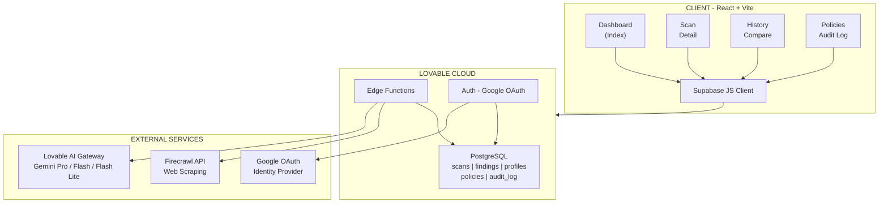

# ThreatLens

### Automated Threat Intelligence & Attack Surface Mapping Platform

**By: Ritvik Induopuri**
**Date: February 25, 2026**

---

## Executive Summary

ThreatLens is an AI-powered cybersecurity platform that automates threat intelligence gathering and attack surface mapping for web domains. It combines automated web crawling via the Firecrawl API with multi-model AI analysis to deliver comprehensive security assessments — including vulnerability detection, security header analysis, technology fingerprinting, and actionable remediation guidance.

The platform features an AI domain policy agent that prevents misuse by automatically evaluating scan targets, an interactive AI analyst chatbot for deep-dive investigations, and a full reporting suite with PDF export capabilities.

---

## Table of Contents

- [Key Features](#key-features)
- [System Architecture](#system-architecture)
- [Tech Stack](#tech-stack)
- [Setup & Installation](#setup--installation)
- [Technical Documentation](#technical-documentation)
- [Conclusion](#conclusion)

---

## Key Features

- **Automated Domain Scanning** — One-click reconnaissance via Firecrawl API with URL discovery (up to 500 endpoints), HTML parsing, and technology fingerprinting
- **AI Domain Policy Agent** — Gemini Flash Lite-powered allowlist/blocklist system that auto-approves safe sites, blocks sensitive targets (.mil, critical infrastructure), and flags ambiguous domains for review
- **Interactive AI Analyst** — Context-aware chatbot on every scan detail page with three analysis modes (Attack Surface, Findings, Raw Data) and suggested questions
- **Attack Surface Analysis** — Discovered endpoints, client-side scripts, input vectors, external dependencies, and security header assessment with interactive tooltips
- **Vulnerability Detection** — Missing security headers, exposed admin panels, suspicious query parameters, XSS input points, outdated libraries, and supply chain risks
- **Risk Scoring** — Composite 0–100 score calculated from weighted severity findings (Critical: 25pts, High: 15pts, Medium: 8pts, Low: 3pts, Info: 1pt)
- **AI Threat Reports** — One-click comprehensive reports with executive summary, vulnerability analysis, and remediation roadmap (Gemini Pro)
- **PDF Export** — Professional branded reports with cover page, findings summary, AI insights, and confidential watermarking
- **Scan Comparison** — Side-by-side delta analysis of risk scores, vulnerabilities, technologies, and endpoints between any two scans
- **Authentication** — Google OAuth with profile-based registration gate and protected routes
- **Scan History** — Chronological management with delete capability, aggregate dashboard stats, and risk distribution visualization

---

## System Architecture



<p align="center"><em>Figure 1 — ThreatLens System Architecture Overview</em></p>

ThreatLens follows a three-tier architecture: a React SPA on the client, four serverless edge functions for backend compute, and PostgreSQL for persistence — all orchestrated through Lovable Cloud. Edge functions handle web scraping (Firecrawl), AI analysis (Lovable AI Gateway), and domain policy evaluation, while Google OAuth manages authentication. For a detailed breakdown of every component, data flow, and system interaction, see the [Technical Documentation](./TECHNICAL_DOCS.md).

---

## Tech Stack

| Layer | Technology |
|-------|-----------|
| **Frontend** | React 18, TypeScript, Vite |
| **Styling** | Tailwind CSS, shadcn/ui, Framer Motion |
| **State** | React hooks, TanStack React Query |
| **Routing** | React Router v6 |
| **Backend** | Lovable Cloud (Supabase), Deno Edge Functions |
| **Database** | PostgreSQL with Row Level Security |
| **Auth** | Google OAuth (Lovable Cloud managed) |
| **AI Models** | Google Gemini 2.5 Pro, Gemini 2.5 Flash, Gemini 2.5 Flash Lite |
| **Web Scraping** | Firecrawl API (scrape + map endpoints) |
| **PDF Export** | jsPDF |
| **Charts** | Recharts |

---

## Setup & Installation

### Prerequisites
- Node.js 18+ or Bun
- A Lovable account with Cloud enabled
- Firecrawl API key

### Steps

1. **Clone the repository**
   ```bash
   git clone <repository-url>
   cd threatlens
   ```

2. **Install dependencies**
   ```bash
   npm install
   ```

3. **Configure environment**
   The `.env` file is auto-managed by Lovable Cloud with:
   - `VITE_SUPABASE_URL`
   - `VITE_SUPABASE_PUBLISHABLE_KEY`
   - `VITE_SUPABASE_PROJECT_ID`

4. **Add required secrets**
   In Lovable Cloud, add the following secret:
   - `FIRECRAWL_API_KEY` — Your Firecrawl API key for web scraping

5. **Run the development server**
   ```bash
   npm run dev
   ```

6. **Access the app**
   Open `http://localhost:5173` in your browser. Sign up with Google to create an account.

---

## Technical Documentation

For comprehensive technical documentation covering every component, system flow, AI integration, database schema, and security architecture in detail, see:

**[TECHNICAL_DOCS.md](./TECHNICAL_DOCS.md)**

---

## Conclusion

ThreatLens demonstrates how modern AI capabilities can be combined with automated web reconnaissance to create a practical, accessible threat intelligence platform. By integrating Firecrawl's web scraping with multi-model AI analysis (Gemini Flash Lite for domain policy evaluation, Gemini Flash for interactive analysis, Gemini Pro for deep threat reports), the platform delivers actionable security insights that would traditionally require hours of manual penetration testing work.

The AI domain policy agent adds a critical layer of responsible use — ensuring the scanning capabilities cannot be weaponized against sensitive targets while maintaining ease of use for legitimate security assessments. The combination of automated detection, interactive AI analysis, and professional reporting makes ThreatLens a comprehensive tool for security professionals and organizations looking to understand and reduce their attack surface.
