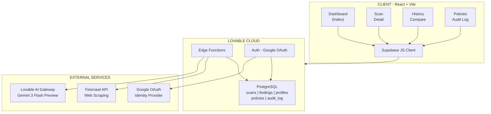

# ThreatLens

### Automated Threat Intelligence & Attack Surface Mapping Platform

**By: Ritvik Induopuri**
**Date: February 25, 2026**

---

ThreatLens is an AI-powered cybersecurity platform that automates threat intelligence gathering and attack surface mapping for web domains. It combines automated web crawling via the Firecrawl API with AI analysis powered by Google's Gemini 3 Flash Preview to deliver comprehensive security assessments — including vulnerability detection, security header analysis, technology fingerprinting, and actionable remediation guidance. The platform features an AI domain policy agent that prevents misuse, an interactive AI analyst chatbot for deep-dive investigations, and a full reporting suite with PDF export capabilities.

---

## Key Features

- **Automated Domain Scanning** — One-click reconnaissance via Firecrawl API with URL discovery (up to 500 endpoints), HTML parsing, and technology fingerprinting
- **AI Domain Policy Agent** — Gemini 3 Flash Preview-powered allowlist/blocklist system that auto-approves safe sites, blocks sensitive targets (.mil, critical infrastructure), and flags ambiguous domains for review
- **Interactive AI Analyst** — Context-aware chatbot on every scan detail page with three analysis modes (Attack Surface, Findings, Raw Data) and suggested questions
- **Attack Surface Analysis** — Discovered endpoints, client-side scripts, input vectors, external dependencies, and security header assessment with interactive tooltips
- **Vulnerability Detection** — Missing security headers, exposed admin panels, suspicious query parameters, XSS input points, outdated libraries, and supply chain risks
- **Risk Scoring** — Composite 0–100 score calculated from weighted severity findings (Critical: 25pts, High: 15pts, Medium: 8pts, Low: 3pts, Info: 1pt)
- **AI Threat Reports** — One-click comprehensive reports with executive summary, vulnerability analysis, and remediation roadmap
- **PDF Export** — Professional branded reports with cover page, findings summary, AI insights, and confidential watermarking
- **Scan Comparison** — Side-by-side delta analysis of risk scores, vulnerabilities, technologies, and endpoints between any two scans
- **Authentication** — Google OAuth with profile-based registration gate and protected routes
- **Scheduled / Recurring Scans** — Configure daily, weekly, biweekly, or monthly automated scans from the Settings page. A backend cron job checks hourly for due schedules and triggers scans automatically.
- **REST API & Programmatic Access** — Generate API keys to trigger scans, retrieve results, and pull findings from scripts, CI/CD pipelines, SIEMs, or any HTTP client — no UI required.
- **Real CVE Vulnerability Scanning** — Detected technologies are matched against the NIST NVD 2.0 database to surface known CVEs with severity scores and reference links.
- **Per-User Rate Limiting** — Configurable daily scan quotas (default 10/day) prevent Firecrawl credit exhaustion and enforce fair usage.
- **Real WHOIS & Geolocation Enrichment** — Live RDAP lookups and ip-api.com geolocation replace all simulated data with real-time registration, hosting, and network details.

---

## REST API (Programmatic Access)

The ThreatLens REST API lets you integrate security scanning into your existing workflows — CI/CD pipelines, automation scripts, SIEMs, or custom dashboards. Generate an API key from the **Settings → API Keys** tab, then use it to trigger scans and retrieve results without the web UI.

### Use Cases

- A **DevOps pipeline** that automatically scans your production domain after every deployment
- A **Python script** that pulls scan findings into a Slack channel or SIEM
- A **third-party tool** that triggers scans and reads results via HTTP

### Endpoints

| Method | Path | Description |
|--------|------|-------------|
| `POST` | `/functions/v1/api-gateway/scan` | Start a new scan |
| `GET` | `/functions/v1/api-gateway/scan/:id` | Get scan details (status, risk score, technologies) |
| `GET` | `/functions/v1/api-gateway/scan/:id/findings` | List all findings (CVEs, misconfigs) |
| `GET` | `/functions/v1/api-gateway/scans` | List recent scans (`?limit=20`) |

### Example

```bash
# Start a scan
curl -X POST https://your-url/functions/v1/api-gateway/scan \
  -H "Content-Type: application/json" \
  -H "x-api-key: tl_your_key_here" \
  -d '{"domain": "example.com"}'

# Get results
curl -H "x-api-key: tl_your_key_here" \
  https://your-url/functions/v1/api-gateway/scan/SCAN_ID

# Get findings
curl -H "x-api-key: tl_your_key_here" \
  https://your-url/functions/v1/api-gateway/scan/SCAN_ID/findings
```

All keys are hashed with SHA-256 — ThreatLens never stores raw keys. Each key is granted `scan:create`, `scan:read`, and `findings:read` permissions by default.

## System Architecture



<p align="center"><em>Figure 1 — ThreatLens System Architecture Overview</em></p>

- **Client Layer** — A React SPA (built with Vite + TypeScript) renders four main pages: Dashboard, Scan Detail, History/Compare, and Policies. All backend communication flows through a single Supabase JS client instance.
- **Lovable Cloud** — Four serverless Deno edge functions handle all backend compute: scan orchestration (`firecrawl-scan`), AI threat reports (`analyze-threats`), interactive AI chat (`analyze-surface`), and domain policy evaluation (`evaluate-domain`). PostgreSQL stores all persistent data across five tables (scans, findings, profiles, domain_policies, scan_audit_log). Google OAuth manages user authentication.
- **External Services** — Two external APIs are consumed: Firecrawl for web scraping (HTML extraction via `/v1/scrape` + site mapping via `/v1/map`) and the Lovable AI Gateway for all AI inference using `google/gemini-3-flash-preview`.
- **Data Flow** — A user enters a domain → the policy agent evaluates it (allow/block/review) → Firecrawl scrapes and maps the site → raw data is parsed into endpoints, technologies, headers, and forms → findings are generated across six categories → a risk score is calculated → the user can then trigger AI reports, chat with the AI analyst, or export PDFs.

For comprehensive technical documentation covering every system flow, database schema, AI integration, and security architecture in detail, see **[TECHNICAL_DOCS.md](./TECHNICAL_DOCS.md)**.

---

## Tech Stack

| Layer | Technology |
|-------|-----------|
| **Frontend** | React 18, TypeScript, Vite |
| **Styling** | Tailwind CSS, shadcn/ui, Framer Motion |
| **State** | React hooks, TanStack React Query |
| **Routing** | React Router v6 |
| **Backend** | Lovable Cloud (Supabase), Deno Edge Functions |
| **Database** | PostgreSQL with Row Level Security |
| **Auth** | Google OAuth (Lovable Cloud managed) |
| **AI Models** | Google Gemini 3 Flash Preview (all functions) |
| **Web Scraping** | Firecrawl API (scrape + map endpoints) |
| **PDF Export** | jsPDF |
| **Charts** | Recharts |

---

## Live Demo

View the live application here: **[https://intelligence-lens.lovable.app](https://intelligence-lens.lovable.app)**

---

## Setup & Installation

### Prerequisites
- Node.js 18+ or Bun
- A Lovable account with Cloud enabled
- Firecrawl API key

### Steps

1. **Clone the repository**
   ```bash
   git clone <repository-url>
   cd threatlens
   ```

2. **Install dependencies**
   ```bash
   npm install
   ```

3. **Configure environment**
   The `.env` file is auto-managed by Lovable Cloud with:
   - `VITE_SUPABASE_URL`
   - `VITE_SUPABASE_PUBLISHABLE_KEY`
   - `VITE_SUPABASE_PROJECT_ID`

4. **Add required secrets**
   In Lovable Cloud, add the following secret:
   - `FIRECRAWL_API_KEY` — Your Firecrawl API key for web scraping

5. **Run the development server**
   ```bash
   npm run dev
   ```

6. **Access the app**
   Open `http://localhost:5173` in your browser. Sign up with Google to create an account.
