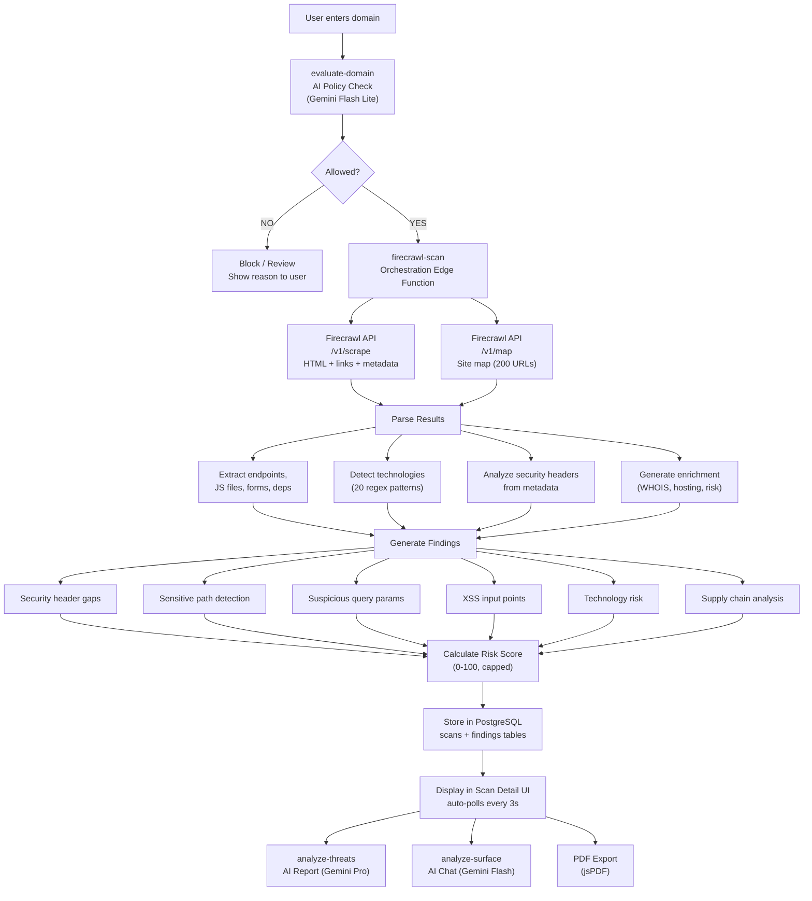
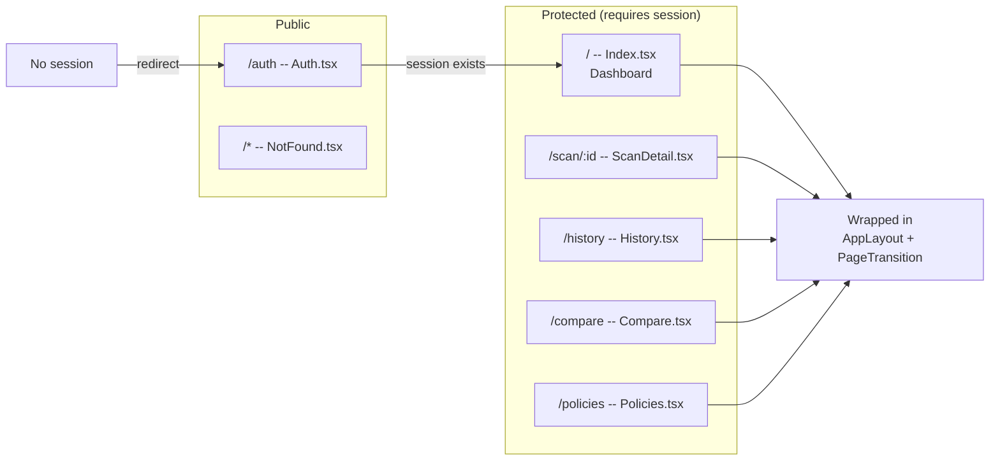
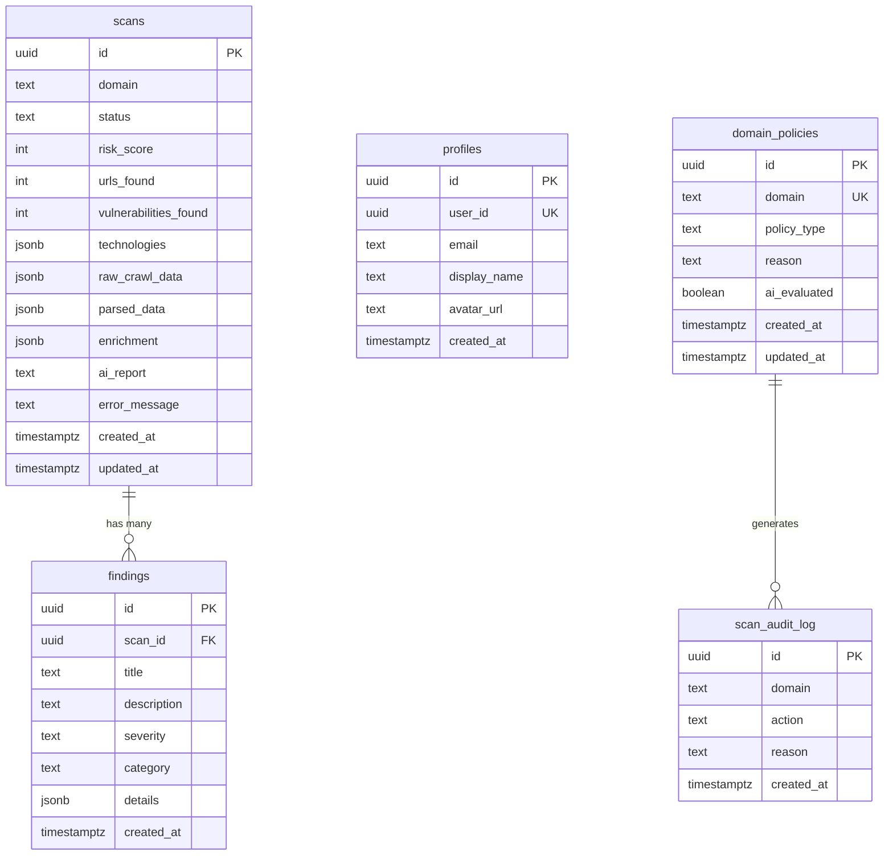
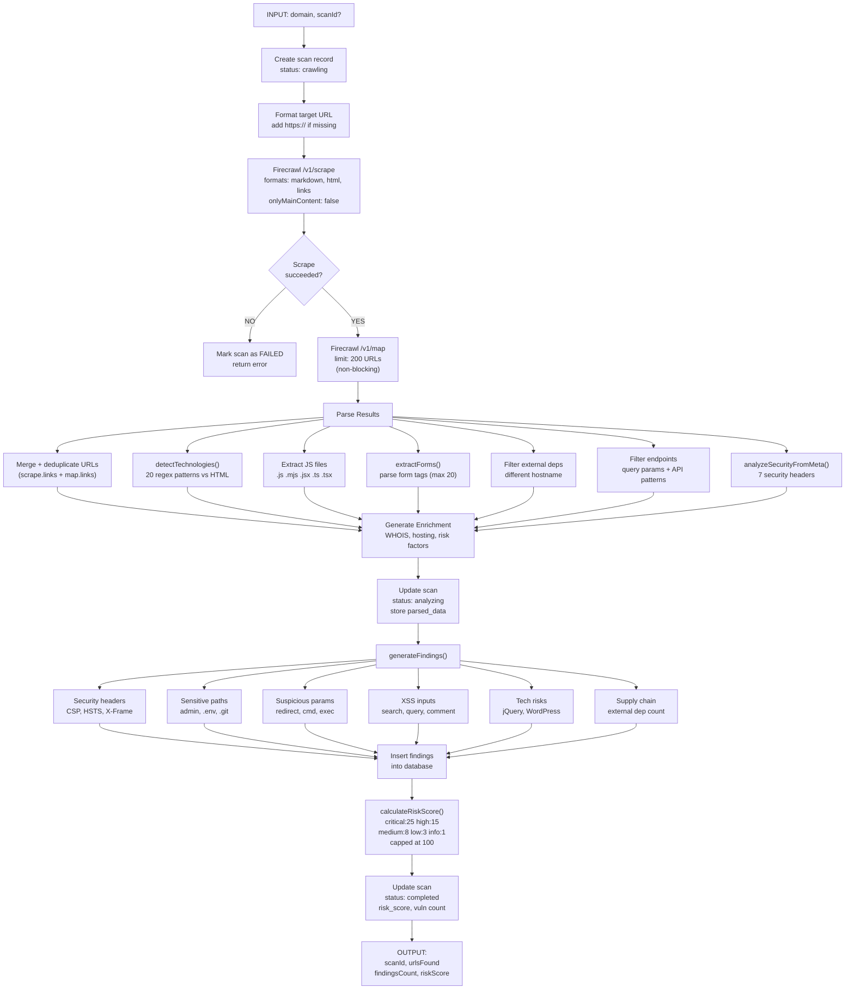
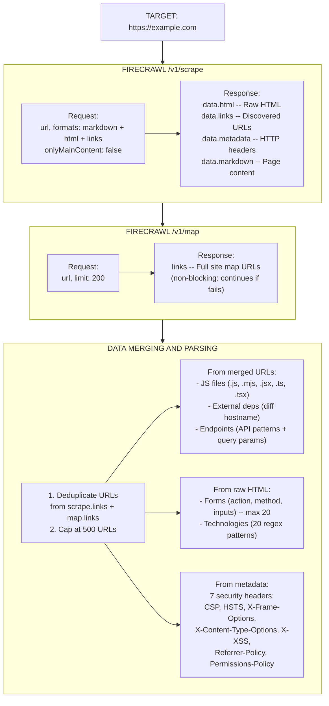
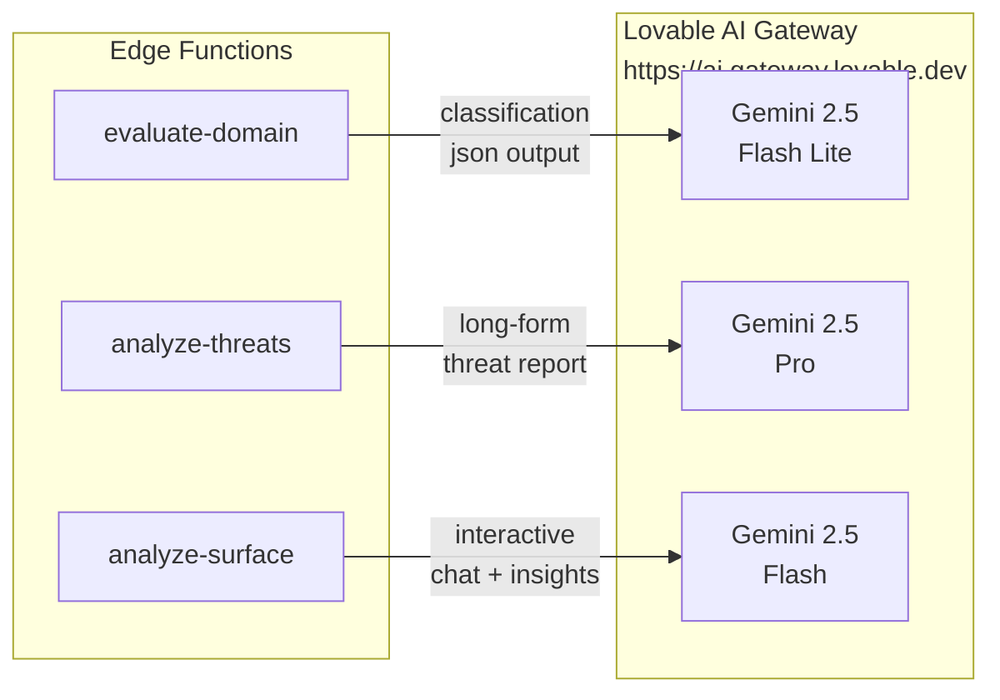
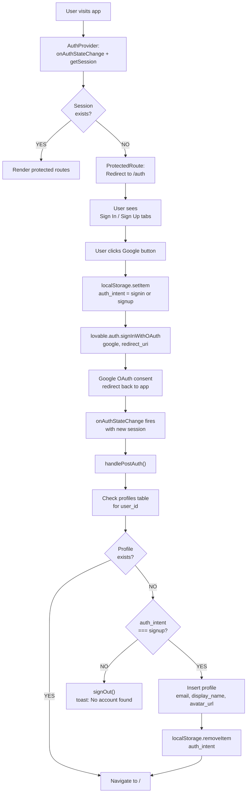
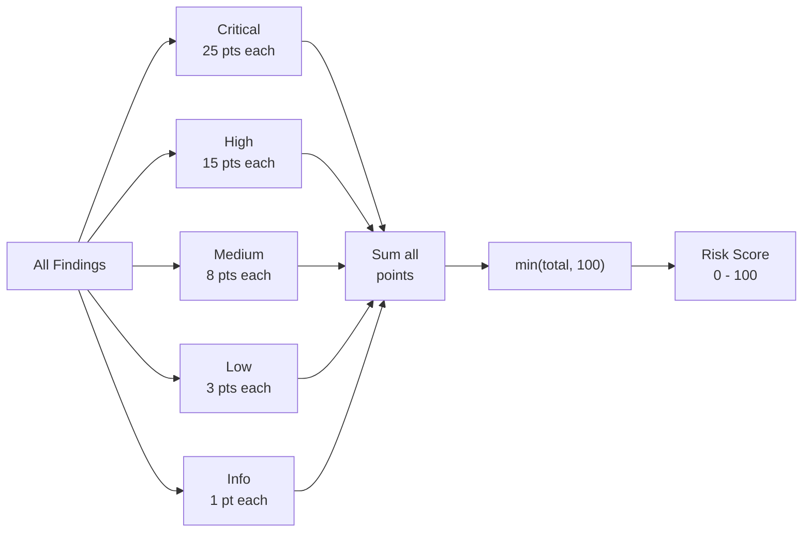

# ThreatLens — Technical Documentation

### Comprehensive Technical Reference

**By: Ritvik Induopuri**
**Date: February 25, 2026**

---

## Table of Contents

1. [Executive Summary](#1-executive-summary)
2. [System Architecture Deep Dive](#2-system-architecture-deep-dive)
   - 2.1 [High-Level Data Flow](#21-high-level-data-flow)
   - 2.2 [Component Architecture](#22-component-architecture)
   - 2.3 [Routing & Protected Routes](#23-routing--protected-routes)
3. [Database Schema](#3-database-schema)
   - 3.1 [scans Table](#31-scans-table)
   - 3.2 [findings Table](#32-findings-table)
   - 3.3 [profiles Table](#33-profiles-table)
   - 3.4 [domain_policies Table](#34-domain_policies-table)
   - 3.5 [scan_audit_log Table](#35-scan_audit_log-table)
   - 3.6 [Entity Relationship Diagram](#36-entity-relationship-diagram)
4. [Edge Functions (Backend)](#4-edge-functions-backend)
   - 4.1 [Firecrawl Scan Pipeline](#41-firecrawl-scan-pipeline)
   - 4.2 [AI Threat Report Generator](#42-ai-threat-report-generator)
   - 4.3 [AI Surface Analyst (Chatbot & Insights)](#43-ai-surface-analyst-chatbot--insights)
   - 4.4 [AI Domain Policy Agent](#44-ai-domain-policy-agent)
5. [Firecrawl Web Scraping Process](#5-firecrawl-web-scraping-process)
   - 5.1 [Scraping Flow Diagram](#51-scraping-flow-diagram)
   - 5.2 [Data Extraction Details](#52-data-extraction-details)
6. [AI Integration](#6-ai-integration)
   - 6.1 [Models Used](#61-models-used)
   - 6.2 [AI Gateway Integration](#62-ai-gateway-integration)
7. [Frontend Components](#7-frontend-components)
   - 7.1 [Pages](#71-pages)
   - 7.2 [Core Components](#72-core-components)
   - 7.3 [UI Component Library](#73-ui-component-library)
8. [Authentication System](#8-authentication-system)
   - 8.1 [Auth Flow Diagram](#81-auth-flow-diagram)
   - 8.2 [Session Management](#82-session-management)
9. [Risk Scoring Algorithm](#9-risk-scoring-algorithm)
10. [PDF Export Engine](#10-pdf-export-engine)
11. [Design System & Styling](#11-design-system--styling)
    - 11.1 [CSS Token Architecture](#111-css-token-architecture)
    - 11.2 [Custom Utilities](#112-custom-utilities)
    - 11.3 [Typography](#113-typography)
12. [Security Architecture](#12-security-architecture)
13. [API Layer](#13-api-layer)
14. [Conclusion](#14-conclusion)

---

## 1. Executive Summary

ThreatLens is a full-stack cybersecurity platform that automates the process of domain reconnaissance, vulnerability detection, and threat intelligence reporting. The system ingests a target domain, crawls it using the Firecrawl API, parses the results for security-relevant data (endpoints, scripts, forms, headers, technologies), generates findings with severity ratings, calculates a composite risk score, and provides AI-powered analysis through both automated reports and an interactive chatbot.

The platform is designed with three core principles:
1. **Automation** — Minimize manual effort in security assessment
2. **Intelligence** — Leverage AI models for context-aware analysis
3. **Responsibility** — Prevent misuse via an AI domain policy gatekeeper

To understand how these principles translate into a working system, the next section dissects the architecture that ties the frontend, backend, and external services together into a unified pipeline.

---

## 2. System Architecture Deep Dive

The architecture of ThreatLens follows a three-tier model: a React single-page application on the client, serverless edge functions for compute, and PostgreSQL for persistence — all orchestrated through Lovable Cloud. This section walks through the data flow, component organization, and routing structure that make the platform work.

### 2.1 High-Level Data Flow



<p align="center"><em>Figure 1 — End-to-End Data Flow: From Domain Input to Intelligence Output</em></p>

**Flow Explanation:** The diagram traces the complete lifecycle of a scan request. When a user enters a domain, it first passes through the **AI Domain Policy Agent** (`evaluate-domain`), which classifies the domain as allowed, blocked, or review using Gemini Flash Lite. Only allowed domains proceed to the **Firecrawl Scan Pipeline** (`firecrawl-scan`), which orchestrates two Firecrawl API calls — a scrape for full HTML content and a map for site-wide URL discovery. The raw data then enters a multi-stage **parsing pipeline** that extracts endpoints, JavaScript files, HTML forms, external dependencies, and technologies via 20 regex patterns. Security headers are analyzed from the response metadata, and enrichment data (WHOIS, hosting info) is generated. The parsed data feeds into a **finding generation engine** that checks for security header gaps, sensitive exposed paths, suspicious query parameters, XSS input points, technology risks, and supply chain vulnerabilities. Each finding is assigned a severity (critical/high/medium/low/info), and a **composite risk score** is calculated from the weighted sum (capped at 100). Everything is persisted to PostgreSQL, and the frontend polls every 3 seconds until the scan completes. From the completed scan, users can trigger three output paths: an **AI threat report** (Gemini Pro), an **interactive AI chatbot** (Gemini Flash), or a **PDF export** (jsPDF).

With the data flow established, the next question is how the codebase itself is organized to support this pipeline.

### 2.2 Component Architecture

```
src/
├── pages/
│   ├── Auth.tsx          # Sign in / Sign up with Google OAuth
│   ├── Index.tsx         # Dashboard with stats, recent scans, scan form
│   ├── ScanDetail.tsx    # Full scan results (4 tabs: Findings, Surface, Report, Raw Data)
│   ├── History.tsx       # All scans list with delete capability
│   ├── Compare.tsx       # Side-by-side scan comparison
│   ├── Policies.tsx      # Domain policy management + audit log
│   └── NotFound.tsx      # 404 error page
├── components/
│   ├── AppLayout.tsx     # Header nav, logo, user avatar popover, sign out
│   ├── AuthProvider.tsx  # Session context provider (onAuthStateChange + getSession)
│   ├── ScanForm.tsx      # Domain input with two-phase submit (evaluate then scan)
│   ├── AiChatPanel.tsx   # Interactive AI analyst chatbot with markdown rendering
│   ├── AiSurfaceInsight.tsx  # One-click AI analysis button for surface sections
│   ├── RiskScoreBreakdown.tsx # Detailed risk visualization with bar chart
│   ├── SeverityBadge.tsx # SeverityBadge, StatusBadge, RiskScoreGauge exports
│   ├── PageTransition.tsx # Framer Motion page transitions + stagger/fadeInUp/scaleIn
│   └── NavLink.tsx       # React Router NavLink wrapper with active state classes
├── lib/
│   ├── api.ts            # API layer (scan, evaluate, report, CRUD operations)
│   ├── pdf-export.ts     # PDF report generation engine (jsPDF)
│   └── utils.ts          # Utility functions (cn helper)
└── integrations/
    ├── supabase/
    │   ├── client.ts     # Auto-generated Supabase client
    │   └── types.ts      # Auto-generated database types
    └── lovable/
        └── index.ts      # Google OAuth integration (lovable.auth)

supabase/functions/
├── firecrawl-scan/       # Main scan orchestration
├── analyze-threats/      # AI threat report generation (Gemini Pro)
├── analyze-surface/      # AI interactive analysis (Gemini Flash) — 7 section handlers
└── evaluate-domain/      # AI domain policy evaluation (Gemini Flash Lite)
```

<p align="center"><em>Figure 2 — Project File Structure and Component Organization</em></p>

These components don't all render on every page — React Router controls which pages are mounted based on the current URL, and a protected-route wrapper ensures unauthenticated users never reach the application interior.

### 2.3 Routing & Protected Routes



<p align="center"><em>Figure 3 — Application Routing Map with Protected Route Guards</em></p>

**Routing Explanation:** The application uses React Router v6 with a `ProtectedRoute` wrapper component defined in `App.tsx`. Public routes (`/auth` and the 404 catch-all) are accessible without authentication. All other routes are protected — if no session exists, the user is redirected to `/auth`. The `/auth` route itself checks for an existing session and redirects authenticated users to `/` to prevent accessing the login page when already signed in. Every protected route is wrapped with two higher-order components: `AppLayout` (which renders the sticky header with navigation, logo, and user avatar popover) and `PageTransition` (which applies Framer Motion fade + slide animations for smooth page transitions).

Now that we've seen how data flows through the system and how the client is organized, the next layer to examine is where all of this data lives — the PostgreSQL database schema that underpins every scan, finding, policy, and user profile.

---

## 3. Database Schema

The database is the backbone of ThreatLens, storing everything from raw crawl data to AI-generated reports. Five tables work together to support the scan lifecycle, vulnerability tracking, user management, domain policy enforcement, and audit logging. Each table is designed with specific JSONB columns to accommodate the flexible, deeply nested data structures that web scraping and AI analysis produce.

### 3.1 `scans` Table
The primary table storing all scan results. Every scan begins as a `crawling` record and progresses through `analyzing` to `completed` (or `failed`). The JSONB columns (`raw_crawl_data`, `parsed_data`, `enrichment`, `technologies`) store the full depth of scraping and analysis results without requiring rigid column definitions.

| Column | Type | Description |
|--------|------|-------------|
| `id` | UUID (PK) | Auto-generated scan identifier |
| `domain` | TEXT | Target domain that was scanned |
| `status` | TEXT | `crawling`, `analyzing`, `completed`, `failed` |
| `risk_score` | INTEGER | Composite risk score (0–100) |
| `urls_found` | INTEGER | Total number of URLs discovered |
| `vulnerabilities_found` | INTEGER | Total number of findings generated |
| `technologies` | JSONB | Array of detected technology names |
| `raw_crawl_data` | JSONB | Full Firecrawl response (`{ scrape, map }`) |
| `parsed_data` | JSONB | Structured data: `{ urls, jsFiles, forms, endpoints, externalDependencies, metadata, securityHeaders }` |
| `enrichment` | JSONB | `{ whois, hosting, riskFactors }` |
| `ai_report` | TEXT | AI-generated threat intelligence report (markdown) |
| `error_message` | TEXT | Error details if scan failed |
| `created_at` | TIMESTAMPTZ | Scan creation timestamp |
| `updated_at` | TIMESTAMPTZ | Last update timestamp |

### 3.2 `findings` Table
Each scan produces zero or more findings — individual vulnerability detections linked back to the parent scan via `scan_id`. Findings are the atomic units that feed into risk scoring, severity breakdowns, and AI analysis.

| Column | Type | Description |
|--------|------|-------------|
| `id` | UUID (PK) | Finding identifier |
| `scan_id` | UUID (FK → scans) | Parent scan reference |
| `title` | TEXT | Finding title |
| `description` | TEXT | Detailed description |
| `severity` | TEXT | `critical`, `high`, `medium`, `low`, `info` |
| `category` | TEXT | `Security Headers`, `Exposed Paths`, `Injection Points`, `XSS`, `Outdated Libraries`, `CMS Risk`, `Supply Chain` |
| `details` | JSONB | Additional structured details (header name, URL, recommendation, etc.) |
| `created_at` | TIMESTAMPTZ | Creation timestamp |

### 3.3 `profiles` Table
While scans and findings are shared across all users, the `profiles` table is the only user-specific table — it stores registration data from Google OAuth and serves as the registration gate that distinguishes signed-up users from anonymous Google account holders.

| Column | Type | Description |
|--------|------|-------------|
| `id` | UUID (PK) | Profile identifier |
| `user_id` | UUID (UNIQUE) | Auth user ID reference |
| `email` | TEXT | User's email address |
| `display_name` | TEXT | User's display name (from Google) |
| `avatar_url` | TEXT | Google avatar URL |
| `created_at` | TIMESTAMPTZ | Registration timestamp |

### 3.4 `domain_policies` Table
Before any scan executes, the domain must pass through a policy check. This table caches the results of AI evaluations and manual overrides so that repeat scans against the same domain don't require redundant AI calls.

| Column | Type | Description |
|--------|------|-------------|
| `id` | UUID (PK) | Policy identifier |
| `domain` | TEXT (UNIQUE) | Target domain (cleaned, lowercase) |
| `policy_type` | TEXT | `allow`, `block`, or `review` |
| `reason` | TEXT | Explanation for the policy decision |
| `ai_evaluated` | BOOLEAN | Whether AI made this decision (vs manual) |
| `created_at` | TIMESTAMPTZ | Creation timestamp |
| `updated_at` | TIMESTAMPTZ | Last update timestamp |

### 3.5 `scan_audit_log` Table
Every domain evaluation — whether served from the policy cache or freshly evaluated by AI — generates an immutable audit log entry. This table provides the accountability trail visible on the Policies page and is append-only by design.

| Column | Type | Description |
|--------|------|-------------|
| `id` | UUID (PK) | Log entry identifier |
| `domain` | TEXT | Domain that was evaluated |
| `action` | TEXT | `approved`, `blocked`, or `flagged` |
| `reason` | TEXT | Evaluation reason (prefixed with "Existing policy:" or "AI evaluation:") |
| `created_at` | TIMESTAMPTZ | Timestamp |

### 3.6 Entity Relationship Diagram

The following diagram shows how these five tables relate to each other. The only true foreign key relationship is between `scans` and `findings` — the other tables are logically connected through shared domain values and the scan lifecycle but remain structurally independent for flexibility and performance.



<p align="center"><em>Figure 4 — Database Entity Relationship Diagram</em></p>

**Schema Explanation:** The `scans` table is the central entity — each scan produces multiple `findings` (one-to-many relationship via `scan_id` foreign key). The `profiles` table stores user registration data keyed by `user_id` and is the only table with Row Level Security restricted to the owning user. The `domain_policies` table caches AI and manual domain classifications, and each policy evaluation (whether from cache or fresh AI inference) generates an entry in the `scan_audit_log` for immutable audit tracking. The `scans` and `findings` tables are open-access (shared scan data), while `profiles` enforces per-user access control.

With the data model defined, the next question is: what code actually reads from and writes to these tables? That's the job of the four serverless edge functions that form ThreatLens's backend compute layer.

---

## 4. Edge Functions (Backend)

The backend logic lives entirely in four Deno-based edge functions deployed to Lovable Cloud. Each function serves a distinct role in the scan lifecycle: `firecrawl-scan` orchestrates the crawling and analysis pipeline, `analyze-threats` generates AI reports, `analyze-surface` powers the interactive chatbot, and `evaluate-domain` gates every scan request through the AI policy agent. Together, they transform a raw domain name into structured intelligence — reading from and writing to the database tables described above.

### 4.1 Firecrawl Scan Pipeline

**File**: `supabase/functions/firecrawl-scan/index.ts`

This is the core orchestration function that manages the entire scan lifecycle. It requires the `FIRECRAWL_API_KEY` secret and is the most complex of the four edge functions — handling everything from API calls to data parsing to finding generation in a single invocation.

#### Process Flow



<p align="center"><em>Figure 5 — Firecrawl Scan Pipeline: Complete Orchestration Flow</em></p>

**Pipeline Explanation:** This is the most complex edge function in ThreatLens. It begins by creating a scan record in the database (status: `crawling`), then makes two sequential Firecrawl API calls — first a **scrape** for full HTML content, links, and metadata, then a **map** for a broader site URL inventory. If the scrape fails, the scan is immediately marked as failed. The map call is non-blocking (continues if it fails). The raw data then enters a seven-step **parsing phase**: URL deduplication and capping (500 max), technology detection via 20 regex patterns against the HTML source, JavaScript file extraction by file extension, HTML form parsing (capped at 20 forms), external dependency filtering by hostname comparison, endpoint filtering for API-like URL patterns, and security header analysis from response metadata. After parsing, **enrichment data** is generated (simulated WHOIS, hosting provider detection, risk factor assessment). The scan status is updated to `analyzing`, and the **finding generation engine** runs six categories of checks — each producing findings with severity labels. All findings are batch-inserted into the database, a **risk score** is calculated from the weighted severity sum (capped at 100), and the scan is finalized as `completed`.

#### Technology Detection

The `detectTechnologies()` function uses regex pattern matching against the raw HTML to identify **20 technologies**:

| Technology | Detection Pattern |
|-----------|------------------|
| React | `react.production`, `reactDOM`, `__NEXT_DATA__` |
| Next.js | `__NEXT_DATA__`, `_next/` |
| Vue.js | `vue.js`, `__vue__` |
| Angular | `ng-version`, `angular.js` |
| jQuery | `jquery.js`, `jquery.min.js` |
| WordPress | `wp-content`, `wp-includes` |
| Bootstrap | `bootstrap.css`, `bootstrap.js` |
| Tailwind CSS | `tailwindcss`, `tailwind.css` |
| Google Analytics | `google-analytics`, `googletagmanager`, `gtag` |
| Google Tag Manager | `googletagmanager.com/gtm` |
| Cloudflare | `cloudflare`, `cf-ray`, `__cf_bm` |
| Nginx | `nginx` |
| PHP | `.php` |
| ASP.NET | `asp.net`, `__VIEWSTATE`, `__EVENTVALIDATION` |
| Shopify | `shopify.com`, `cdn.shopify` |
| Wix | `wix.com`, `parastorage.com` |
| Squarespace | `squarespace.com`, `sqsp.net` |
| Drupal | `drupal.js`, `drupal.settings` |
| HubSpot | `hubspot.com`, `hs-scripts` |
| Stripe | `stripe.com`, `stripe.js` |

#### Finding Generation Categories

| Category | Checks | Severity |
|----------|--------|----------|
| Security Headers | Missing CSP | High |
| Security Headers | Missing HSTS | Medium |
| Security Headers | Missing X-Frame-Options | Medium |
| Exposed Paths | Admin panels (`/admin`, `/wp-admin`, `/panel`, `/dashboard`) | High |
| Exposed Paths | Sensitive files (`/config`, `/.env`, `/.git`, `/backup`, `/dump`, `/sql`) | Critical |
| Exposed Paths | Database tools (`/phpmyadmin`, `/adminer`, `/phpinfo`) | Critical |
| Injection Points | Suspicious query params (`redirect`, `url`, `file`, `cmd`, `exec`, etc.) | High / Medium |
| XSS | Form inputs with text fields (`search`, `query`, `q`, `comment`, `message`) | Medium |
| Outdated Libraries | jQuery presence | Low |
| CMS Risk | WordPress detection | Medium |
| Supply Chain | >10 external dependencies | Low |

Once the scan pipeline completes and findings are stored, users can request deeper analysis. The next two edge functions handle that — generating comprehensive AI reports and powering the interactive chatbot.

### 4.2 AI Threat Report Generator

**File**: `supabase/functions/analyze-threats/index.ts`

Generates comprehensive enterprise-grade AI threat intelligence reports. While the scan pipeline handles automated detection, this function adds the layer of AI reasoning — interpreting findings in context, estimating CVSS scores, mapping to OWASP categories, and building a prioritized remediation roadmap.

**Input**: `{ scanId }` → Fetches scan + findings from database using service role key

**AI Model**: `google/gemini-2.5-pro` via Lovable AI Gateway (`https://ai.gateway.lovable.dev`)

**AI Prompt Structure**:
- System role: Principal Cybersecurity Analyst at a Fortune 500 firm
- Data provided: Full scan metadata, severity counts, category breakdown, technologies, enrichment (WHOIS, hosting, risk factors), security headers, all findings with details, attack surface metrics
- Output format: 11-section structured markdown report:
  1. Executive Summary
  2. Scope & Methodology
  3. Critical & High-Severity Findings (with CVSS estimates, CWE/OWASP refs)
  4. Medium & Low-Severity Findings (table format)
  5. Attack Surface Analysis (endpoints, tech stack, dependencies, forms)
  6. Security Headers Assessment
  7. Infrastructure & Hosting Analysis
  8. Remediation Roadmap (immediate → long-term)
  9. Compliance Considerations (GDPR, PCI-DSS, SOC 2)
  10. Risk Assessment Overview (with risk matrix)
  11. Conclusion

**Post-generation**: Report is stored in the `scans.ai_report` column.

**Error handling**: Returns specific error codes for rate limiting (429) and credit exhaustion (402).

The threat report provides a one-shot comprehensive analysis, but users often need to ask follow-up questions or drill into specific areas. That's where the interactive AI analyst comes in.

### 4.3 AI Surface Analyst (Chatbot & Insights)

**File**: `supabase/functions/analyze-surface/index.ts`

Powers both the interactive AI chatbot (`AiChatPanel`) and the one-click AI analysis buttons (`AiSurfaceInsight`). Unlike the threat report generator which produces a single monolithic report, this function is designed for targeted, conversational analysis — handling **7 different section types** with tailored prompts that focus on specific aspects of the scan data:

| Section | Source Component | Context Data | Analysis Focus |
|---------|-----------------|-------------|----------------|
| `security_headers` | `AiSurfaceInsight` | Header config object | Per-header risk assessment, exact remediation values |
| `endpoints` | `AiSurfaceInsight` | Discovered URLs (max 40) | Endpoint classification, high-risk paths, recon insights |
| `dependencies` | `AiSurfaceInsight` | External deps (max 30) | Supply chain risk, privacy concerns, Magecart scenarios |
| `raw_data` | `AiSurfaceInsight` | Raw crawl JSON (truncated 12KB) | Infrastructure overview, app fingerprint, data exposure |
| `surface_chat` | `AiChatPanel` (surface tab) | Full surface data + question | Free-form attack surface Q&A |
| `findings_chat` | `AiChatPanel` (findings tab) | All findings + question | Severity prioritization, remediation guidance |
| `raw_data_chat` | `AiChatPanel` (raw data tab) | Raw crawl data + question | Data interpretation and contextualization |

**AI Model**: `google/gemini-2.5-flash` via Lovable AI Gateway

**System prompt**: Principal Cybersecurity Analyst specializing in web app security, pen testing, and threat intelligence. References OWASP, CWE, MITRE ATT&CK.

Before any of these analysis functions can run, though, the domain must first be approved. The fourth and final edge function acts as the gatekeeper that decides whether a scan should proceed at all.

### 4.4 AI Domain Policy Agent

**File**: `supabase/functions/evaluate-domain/index.ts`

The gatekeeper function that evaluates every scan request before execution. This is the first edge function called in any scan workflow — if it blocks the domain, none of the other functions ever fire.


<p align="center"><em>Figure 6 — AI Domain Policy Agent: Evaluation Decision Flow</em></p>

**Policy Agent Explanation:** Every scan request passes through this gatekeeper before any crawling begins. The domain is first cleaned (lowercased, protocol and path stripped), then checked against the `domain_policies` table for an existing cached policy. If a policy exists, it's returned immediately with an audit log entry — no AI call is needed. For unknown domains, the function invokes **Gemini 2.5 Flash Lite** via the Lovable AI Gateway with a classification prompt that defines three categories: **ALLOW** (public websites, businesses, SaaS, education, open-source), **BLOCK** (military, intelligence agencies, critical infrastructure, healthcare patient portals, banking, honeypots), and **REVIEW** (ambiguous, small government, suspicious TLDs). The AI responds with a JSON object containing the policy and a human-readable reason. If the AI call fails (rate limit, network error, unparseable response), the function defaults to `review` with a descriptive error message explaining *why* it failed — e.g., "The AI evaluation service is temporarily rate-limited" or "AI evaluation encountered a network error." The policy is stored in `domain_policies` for future cache hits, and an audit log entry is created for accountability.

The edge functions above reference Firecrawl API calls extensively but only at a high level. The next section zooms into the scraping process itself — the specific API endpoints, request parameters, response structures, and data extraction logic that turn a domain name into structured security data.

---

## 5. Firecrawl Web Scraping Process

Firecrawl is the data acquisition engine at the heart of ThreatLens. The `firecrawl-scan` edge function uses two Firecrawl API endpoints — `/v1/scrape` for deep single-page extraction and `/v1/map` for broad site-wide URL discovery. This section details exactly what data is requested, what comes back, and how it's parsed into the structured format stored in the database.

### 5.1 Scraping Flow Diagram



<p align="center"><em>Figure 7 — Firecrawl Web Scraping Pipeline: Two-Phase Data Acquisition and Parsing</em></p>

**Scraping Explanation:** The scraping process uses two Firecrawl API endpoints in sequence. The **/v1/scrape** endpoint retrieves the full HTML content, all hyperlinks, HTTP response metadata (headers), and a markdown representation of the page — with `onlyMainContent: false` to capture the entire page including navigation, footers, and hidden elements. The **/v1/map** endpoint then discovers additional URLs across the site (capped at 200) by following the sitemap and internal links. The map call is non-blocking — if it fails, the pipeline continues with scrape data alone. In the **merging phase**, URLs from both sources are deduplicated and capped at 500. Three parallel extraction paths run: (1) from the merged URL list, JavaScript files are identified by extension, external dependencies are filtered by hostname comparison, and endpoints are detected by query parameter presence or API-like URL patterns; (2) from the raw HTML, forms are parsed using regex to extract action URLs, methods, and input field names (max 20 forms), and technologies are detected via 20 regex patterns; (3) from the response metadata, 7 security headers are checked — present values are stored, missing ones are marked as "Not Set."

### 5.2 Data Extraction Details

**Endpoint Filtering**: URLs containing `?` (query params) or matching API patterns:
```regex
/(api|graphql|rest|v\d|admin|login|dashboard|wp-|config)/i
```

**Form Extraction**: Regex-based HTML parsing:
```regex
/<form[^>]*action=["']?([^"'\s>]*)["']?[^>]*method=["']?([^"'\s>]*)["']?[^>]*>([\s\S]*?)<\/form>/gi
```
Extracts: action URL, HTTP method, input field names (capped at 20 forms).

**External Dependency Detection**: Compares each URL's hostname against the target domain — different host = external dependency (capped at 100).

**Security Header Analysis**: Reads from Firecrawl metadata object. Each of 7 headers is checked — present values stored, missing values marked as `"Not Set"`.

Firecrawl provides the raw data, but it takes AI to turn that data into actionable intelligence. The next section covers how ThreatLens integrates with multiple AI models through a unified gateway, and why different functions use different models.

---

## 6. AI Integration

All three AI-powered edge functions use the **Lovable AI Gateway** (`https://ai.gateway.lovable.dev/v1/chat/completions`) for inference. No user API keys are required — the `LOVABLE_API_KEY` environment variable is auto-provisioned by Lovable Cloud. This unified gateway approach means all AI calls follow the same OpenAI-compatible API pattern, differing only in the model selected and the prompt constructed.

### 6.1 Models Used

ThreatLens employs three different Gemini models, each chosen for the specific demands of its task:

| Function | Model | Reasoning |
|----------|-------|-----------|
| Domain Policy Evaluation | `google/gemini-2.5-flash-lite` | Fast and cheap; simple JSON classification task |
| Threat Report Generation | `google/gemini-2.5-pro` | Highest quality; complex long-form report with CVE/OWASP references |
| Interactive Chat & Surface Analysis | `google/gemini-2.5-flash` | Balanced speed/quality for multi-turn context-aware analysis |



<p align="center"><em>Figure 8 — AI Model Selection Strategy: Each Function Uses the Optimal Model</em></p>

**Model Strategy Explanation:** ThreatLens employs a deliberate multi-model strategy where each function uses the AI model best suited to its task complexity and latency requirements. **Gemini 2.5 Flash Lite** handles domain policy evaluation — a simple JSON classification task that needs to be fast and cheap since it runs on every scan request. **Gemini 2.5 Pro** (the most capable model) generates comprehensive threat reports that require deep reasoning about CVE references, CVSS scoring, OWASP mapping, and compliance implications — quality matters more than speed here since reports are generated on-demand. **Gemini 2.5 Flash** powers the interactive chatbot and surface analysis, balancing response quality with the low latency needed for conversational interactions. All three route through the same Lovable AI Gateway endpoint, authenticated via the auto-provisioned `LOVABLE_API_KEY`.

### 6.2 AI Gateway Integration

All edge functions use the same integration pattern:

```
Edge Function
  → POST https://ai.gateway.lovable.dev/v1/chat/completions
  → Headers: Authorization: Bearer ${LOVABLE_API_KEY}
  → Body: {
      model: "google/gemini-2.5-pro" | "google/gemini-2.5-flash" | "google/gemini-2.5-flash-lite",
      messages: [
        { role: "system", content: "..." },
        { role: "user", content: "..." }
      ]
    }
  → Response: { choices: [{ message: { content: string } }] }
```

**Authentication**: Uses `LOVABLE_API_KEY` environment variable (auto-provided by Lovable Cloud). This key is managed automatically — users never need to configure it.

**Error Handling**: All functions handle three error states:
- **429 Too Many Requests** — Rate limited; returns descriptive message to user
- **402 Payment Required** — Credits exhausted; surfaces billing guidance
- **Network/Parse errors** — Falls back gracefully with explanatory messages

The backend is only half the story — all of this data and AI analysis needs to be presented to the user through an intuitive interface. The next section covers the frontend components that render scans, findings, reports, and interactive analysis into a cohesive user experience.

---

## 7. Frontend Components

The React frontend is organized into seven page components and eight core components, all rendered within a shared layout that provides navigation, authentication state, and page transition animations. Each page maps to a specific step in the user workflow — from authentication to scanning to analysis to comparison — and leverages the API layer (covered in Section 13) to communicate with the backend.

### 7.1 Pages

#### `Auth.tsx` — Authentication
The entry point for all new and returning users. This page handles the full Google OAuth lifecycle:
- Tab-based Sign In / Sign Up UI with custom tab switcher (not shadcn tabs)
- Google OAuth via `lovable.auth.signInWithOAuth("google")`
- `auth_intent` stored in localStorage to distinguish signup vs signin after OAuth redirect
- Profile-based registration gate:
  - **Sign Up**: Creates a `profiles` row with `user_id`, email, display_name, avatar_url from Google metadata
  - **Sign In**: Checks for existing profile → rejects with "No account found" if missing
- Unauthorized users signed out with error toast
- Animated background with radial gradient

#### `Index.tsx` — Dashboard
Once authenticated, users land on the dashboard — the operational hub that provides an at-a-glance overview of scanning activity and serves as the primary entry point for new scans:
- Animated hero section with 3 concentric pulsing radar rings (Framer Motion)
- ThreatLens logo with pulse ring animation
- `ScanForm` component for domain input
- Stats grid (4 cards): Total Scans, Unique Domains, Vulnerabilities, Avg Risk
  - Avg Risk calculated only from **completed** scans (excludes failed/in-progress)
- Recent scans list (last 5) with staggered entry animations
- Risk distribution sidebar — scans bucketed by risk score ranges (≥75 critical, ≥50 high, ≥25 medium, >0 low, 0 info)
- Technology fingerprint cloud — top 8 technologies across all scans with occurrence counts

#### `ScanDetail.tsx` — Scan Results (655 lines)
The most complex page in the application — where the bulk of scan intelligence is consumed. Users navigate here after initiating a scan or clicking a scan from the dashboard/history. It's organized into **four tabs** that separate concerns:

**Header area** (always visible):
- Domain name, status badge, scan timestamp
- Refresh, Export PDF, Generate AI Report buttons
- Progress card for in-progress scans (crawling/analyzing) with 3-second auto-poll interval
- Error card for failed scans with error message

**Stats row** (completed scans):
- 5 stat cards with tooltips: Risk Score (with scoring formula tooltip), URLs Found, Vulnerabilities, Technologies, JS Files
- Severity determination guide (Critical/High/Medium/Low definitions)
- Domain enrichment panel (WHOIS registrar, hosting provider, ASN, surface size)

**Tab 1: Findings**
- AI Chat Panel (findings context)
- Finding cards with severity badge, category label, title, description
- Staggered entry animations
- Shield icon when no findings detected

**Tab 2: Attack Surface**
- Attack Surface Summary table (5 rows: Security Headers, Endpoints, External Deps, JS Files, Input Vectors) with count, status, and risk implication
- AI Chat Panel (surface context)
- 4 clickable stat cards that scroll to detail sections (with tooltips explaining security implications)
- Technology Stack display (chips with primary styling)
- Security Headers table (green dot = set, red dot = missing, truncated values)
- Discovered Endpoints scrollable list
- JS Files and Forms side-by-side grid
- External Dependencies scrollable list

**Tab 3: AI Report**
- Generate button (if no report exists)
- Rendered markdown report with `renderMarkdown()` parser
- Copy Report and Download PDF buttons

**Tab 4: Raw Data**
- AI Chat Panel (raw_data context)
- Full raw crawl data displayed as formatted JSON in a scrollable `<pre>` block

#### `History.tsx` — Scan History
While the dashboard shows the 5 most recent scans, the History page provides a complete chronological view with management capabilities:
- Chronological list of all scans
- Each scan shows: domain, timestamp, URL count, findings count, status badge, risk score
- Delete button with AlertDialog confirmation
- Cascading delete: findings first, then scan record
- Staggered entry animations

#### `Compare.tsx` — Scan Comparison
For organizations scanning the same domain periodically, the Compare page enables delta analysis between any two completed scans:
- Dual Select dropdowns (only completed scans)
- Mutual exclusion (can't compare a scan with itself)
- Parallel data loading with `Promise.all`
- **Risk Score Change**: Side-by-side with delta indicator (green for improvement, red for regression)
- **Vulnerability changes**: 3-column grid — New Vulnerabilities, Resolved, Persistent (diff by finding title)
- **Technology Changes**: Added (green +), Removed (red −), Unchanged chips
- **Endpoint Changes**: New Endpoints, Removed Endpoints (capped at 30 shown, with "+N more" overflow)

#### `Policies.tsx` — Domain Policy Management
This page is the human override layer on top of the AI policy agent — allowing administrators to manually approve, block, or flag domains, and review the full audit trail:
- Stats row (4 cards): Allowed, Blocked, Under Review, AI Evaluated counts
- Manual policy addition form: domain input, policy type selector, optional reason, Add button
- Domain cleaning on add: lowercase, strip protocol/path
- Duplicate detection with user-friendly error message
- Policy list with hover-reveal controls:
  - Policy type badge (color-coded: green/red/amber)
  - Inline type changer (Select dropdown, opacity-0 until hover)
  - Delete button (opacity-0 until hover)
  - AI-evaluated bot icon indicator
- Audit log (last 50 entries): color-coded action dots, domain, reason, action badge, timestamp

#### `NotFound.tsx` — 404 Page
- Centered layout with "404" heading, "Page not found" message, and link back to home
- Logs 404 errors to console with the attempted pathname

### 7.2 Core Components

Beyond the page components, several reusable components provide shared functionality across multiple pages. These handle everything from domain input to AI interaction to data visualization.

#### `AiChatPanel.tsx`
The interactive AI analyst interface that appears on the ScanDetail page — providing conversational access to the `analyze-surface` edge function:
- Collapsible chat interface — starts as a button, expands to full card panel
- Three context modes: `surface`, `findings`, `raw_data` with distinct labels
- Suggested question chips (4 per context) for quick one-click analysis
- Message history with user (right-aligned) / assistant (left-aligned) styling
- **Markdown renderer** (`renderMarkdown()` — exported function) supporting:
  - Bold text (`**text**`) via inline parser
  - Headers (`##`, `###`, `####`) with styled borders
  - Bullet lists (`-`, `*`) with primary-colored dots
  - Nested bullet lists (indented `-`, `*`) with secondary dots
  - Numbered lists
  - **Tables** — full parser that detects header + separator + data rows, renders styled `<table>` with hover rows
  - Code blocks (``` delimited) with monospace styling
  - Blockquotes (`>`) with left border accent
  - Horizontal rules (`---`)
- Copy-to-clipboard button on every AI response
- Send button + Enter key submission
- Loading state with "Analyzing..." spinner

#### `AiSurfaceInsight.tsx`
Complements the chatbot with one-click AI analysis for specific attack surface sections:
- Supports 4 section types: `security_headers`, `endpoints`, `dependencies`, `raw_data`
- Renders analysis results inline with basic markdown parsing (headers, bold, bullets, numbered lists)
- Calls `onAnalysis` callback to pass results up to ScanDetail for PDF inclusion

#### `ScanForm.tsx`
The domain input component used on both the Dashboard and (implicitly) in the scan workflow:
- Domain input with Globe icon prefix
- Two-phase submit flow:
  1. `evaluateDomain()` — checks AI policy agent
  2. `startScan()` — only if domain is allowed
- Policy status badge (green = allow, red = block, amber = review) with AI reasoning text
- Blocks scan if domain is blocked or under review (shows destructive toast with "Go to Policies" action button)
- Navigates to `/scan/{scanId}` on success

#### `AuthProvider.tsx`
The authentication context that wraps the entire application:
- React context providing `session`, `loading`, and `signOut`
- Sets up `onAuthStateChange` listener **before** calling `getSession()` (proper Supabase pattern to avoid race conditions)
- Provides context to entire app via `useAuth()` hook

#### `RiskScoreBreakdown.tsx`
A detailed visualization of how a scan's risk score was calculated:
- Large score display with color-coded text (Critical/High/Medium/Low)
- Progress bar visualization with animated width
- **Bar chart**: Severity contributions as proportional vertical bars with raw point labels
- Contribution breakdown: Each active severity level showing count × weight = points
- "Raw total capped at 100" note when score exceeds cap
- Severity definitions grid (4 categories with descriptions)
- Collapsible scoring formula details (`<details>` element)

#### `SeverityBadge.tsx` — Three exports:
1. **SeverityBadge**: Icon + label badge (ShieldAlert/AlertTriangle/Shield/ShieldCheck/Info) with severity-specific colors and border
2. **RiskScoreGauge**: Large score number + risk label + animated progress bar
3. **StatusBadge**: Scan status label (pending/crawling/analyzing/completed/failed) with `animate-pulse-glow` for active states

#### `PageTransition.tsx`
Provides smooth visual transitions between pages using Framer Motion:
- `PageTransition` component: AnimatePresence wrapper with fade + slide animations (0.25s, custom easing)
- Exported animation variants:
  - `staggerContainer`: Staggers children by 0.06s
  - `fadeInUp`: Opacity 0→1, y 16→0 (0.35s)
  - `scaleIn`: Opacity 0→1, scale 0.95→1 (0.3s)

#### `NavLink.tsx`
- Wrapper around React Router's `NavLink` with `className`/`activeClassName`/`pendingClassName` support via the `cn()` utility
- Forwarded ref support

### 7.3 UI Component Library

Built on **shadcn/ui** with Radix primitives. Key components actively used:
- `Card`, `CardContent`, `CardHeader`, `CardTitle` — primary layout containers
- `Tabs`, `TabsList`, `TabsTrigger`, `TabsContent` — ScanDetail tab navigation
- `Badge` — policy type labels in Policies page
- `Button` — actions throughout (multiple variants: default, outline, ghost)
- `Input` — domain entry, policy forms
- `Select`, `SelectTrigger`, `SelectContent`, `SelectItem` — scan comparison selectors, policy type pickers
- `AlertDialog` — scan delete confirmation with destructive action styling
- `Tooltip`, `TooltipProvider`, `TooltipTrigger`, `TooltipContent` — stat card explanations, metric tooltips
- `Popover`, `PopoverContent`, `PopoverTrigger` — user avatar menu in header
- `Avatar`, `AvatarImage`, `AvatarFallback` — user profile display with initial fallback
- `Progress` — risk score bars (used in RiskScoreBreakdown)

The frontend components above rely on an authenticated session to function — the `AuthProvider` context, the `ProtectedRoute` wrapper, and the profile-based registration gate all work together to ensure only registered users can access the platform. The next section dives deeper into exactly how that authentication system works end-to-end.

---

## 8. Authentication System

Authentication is the first thing a user encounters and the last line of defense against unauthorized access. ThreatLens uses Google OAuth through Lovable Cloud, but adds a custom **profile-based registration gate** on top — meaning that having a Google account alone isn't enough to access the platform. Users must explicitly sign up, which creates a `profiles` row, before they can sign in on subsequent visits.

### 8.1 Auth Flow Diagram



<p align="center"><em>Figure 9 — Authentication Flow: Google OAuth with Profile-Based Registration Gate</em></p>

**Auth Flow Explanation:** ThreatLens uses a **profile-based registration gate** on top of Google OAuth. When a user visits the app, the `AuthProvider` checks for an existing session via `onAuthStateChange` and `getSession()`. Unauthenticated users are redirected to `/auth`, which shows Sign In and Sign Up tabs. Before initiating the OAuth flow, the app stores `auth_intent` ("signin" or "signup") in localStorage — this is critical because the Google OAuth redirect loses React state. After the OAuth consent flow completes and the user is redirected back, `onAuthStateChange` fires with the new session. The `handlePostAuth()` function then checks the `profiles` table for a matching `user_id`. If a profile exists, the user is navigated to the dashboard regardless of intent. If no profile exists and the intent was "signup," a new profile row is created with the user's Google metadata (email, display name, avatar URL). If no profile exists and the intent was "signin," the user is signed out with an error toast saying "No account found" — this prevents unregistered users from accessing the app even if they have a valid Google account. This dual-gate pattern ensures that only explicitly registered users can operate the platform.

### 8.2 Session Management

- **AuthProvider** creates a React context with `session`, `loading`, `signOut`
- `onAuthStateChange` is registered before `getSession()` per Supabase best practices
- `signOut()` calls `supabase.auth.signOut()` and clears session state to `null`
- Session is checked on every protected route via `ProtectedRoute` wrapper
- User avatar + email shown in header Popover (from `session.user.user_metadata`)
- Loading spinner shown while auth state is being determined

Once authenticated, users interact with scan results — and the most prominent metric they encounter is the risk score. The next section explains exactly how that score is calculated from individual findings.

---

## 9. Risk Scoring Algorithm

Every completed scan produces a single composite risk score between 0 and 100. This score serves as the primary metric across the platform — it's displayed on the dashboard, in scan history, on the detail page, in comparisons, and in PDF reports. The algorithm is intentionally simple and transparent, so users can understand exactly why a domain received its score.

### Scoring Formula



<p align="center"><em>Figure 10 — Risk Score Calculation: Weighted Severity Sum Capped at 100</em></p>

**Scoring Explanation:** The risk score is calculated as a simple weighted sum of all findings, where each severity level contributes a fixed number of points: Critical findings add 25 points each (reflecting their potential for immediate exploitation), High adds 15, Medium adds 8, Low adds 3, and Info adds 1. The raw total is capped at 100 to provide a normalized scale. For example, a scan with 2 critical findings (50pts), 1 high (15pts), and 3 medium (24pts) would produce a raw total of 89, resulting in a risk score of 89. A scan with 5 critical findings (125pts raw) would be capped at 100.

### Score Interpretation

| Range | Label | Color Token |
|-------|-------|-------------|
| 75–100 | Critical Risk | `--severity-critical` (red) |
| 50–74 | High Risk | `--severity-high` (orange) |
| 25–49 | Medium Risk | `--severity-medium` (yellow) |
| 1–24 | Low Risk | `--severity-low` (teal) |
| 0 | No Risk | `--severity-low` (teal) |

### Dashboard Average

Average risk is calculated only from **completed** scans with non-null `risk_score`, excluding failed or in-progress scans that would skew the metric downward.

Risk scores, findings, and AI analysis are all valuable in the browser — but security professionals often need to share results with stakeholders who don't have platform access. That's where the PDF export engine comes in.

---

## 10. PDF Export Engine

**File**: `src/lib/pdf-export.ts`

The PDF export engine transforms a scan's complete intelligence — findings, risk scores, AI reports, and surface analysis — into a professional, branded document suitable for executive briefings, compliance audits, and client deliverables. It runs entirely client-side using jsPDF, requiring no backend involvement.

The generated report follows this structure:

1. **Cover Page** — Dark background (`rgb(15,17,23)`), "THREAT INTELLIGENCE ASSESSMENT REPORT" title, purple accent line, domain, date, report ID (`TL-{scanId.slice(0,8)}`), risk score, finding count, URL count, "CLASSIFICATION: CONFIDENTIAL" label
2. **Findings Summary** — Severity table (count × weight = points per severity), total risk score, detailed finding cards with colored severity badges (`roundedRect`), category labels, descriptions with text wrapping
3. **AI Threat Report** (if generated) — Full markdown-to-PDF rendering with headers (##, ###), bullets, bold text, separators, code blocks
4. **AI Surface Insights** (if generated) — Section-specific analysis with purple accent headers (Security Headers Analysis, Endpoints Analysis, Dependencies Analysis, Raw Data Intelligence)

**Technical features**:
- `checkPageBreak(needed)` — Automatic page breaks when content would exceed available space
- `doc.splitTextToSize(text, width)` — Text wrapping within content margins
- Color-coded severity badges rendered as filled rounded rectangles with white text
- Two-pass footer rendering: Content pages get footer with "Page X of Y" and report ID
- Page numbering excludes cover page (Page 1 of N starts on findings page)
- Dynamic file naming: `ThreatLens_Report_{sanitized_domain}_{date}.pdf`

The PDF report mirrors the visual language of the application itself — the same dark background, purple accents, and severity color coding. That visual consistency is powered by a comprehensive design system, which the next section documents in full.

---

## 11. Design System & Styling

ThreatLens's visual identity is built on a dark-mode-only design system with cybersecurity-themed aesthetics — deep navy backgrounds, purple primary accents, teal secondary accents, and severity-coded colors that carry consistent meaning across every component. All styling is implemented through CSS custom properties (design tokens) consumed by Tailwind utility classes, ensuring that visual changes propagate globally from a single source of truth.

### 11.1 CSS Token Architecture

All colors use HSL values defined in `src/index.css`. The app is **dark-mode only** (no light mode toggle).

| Token | HSL Value | Usage |
|-------|-----------|-------|
| `--background` | `230 15% 6%` | Page background |
| `--foreground` | `220 15% 93%` | Primary text |
| `--card` | `230 14% 9%` | Card backgrounds |
| `--primary` | `252 87% 65%` | Purple accent (buttons, links, highlights) |
| `--secondary` | `230 12% 14%` | Secondary backgrounds, input fields |
| `--muted-foreground` | `225 10% 48%` | Subdued text, labels |
| `--accent` | `172 66% 50%` | Teal accent (complementary) |
| `--destructive` | `0 72% 55%` | Error/delete states |
| `--border` | `230 12% 15%` | Border color |
| `--severity-critical` | `0 72% 55%` | Red severity |
| `--severity-high` | `25 95% 55%` | Orange severity |
| `--severity-medium` | `45 100% 60%` | Yellow severity |
| `--severity-low` | `172 66% 50%` | Teal severity |
| `--severity-info` | `225 10% 48%` | Gray severity |
| `--success` | `152 60% 45%` | Green (resolved, allowed) |

### 11.2 Custom Utilities

Beyond the standard Tailwind utilities, several custom CSS classes provide the platform's signature visual effects:

| Utility Class | Effect |
|--------------|--------|
| `.glass` | Glassmorphism: `background: hsl(card / 0.7)` + `backdrop-filter: blur(20px)` — used on sticky header |
| `.glow-primary` | Purple box-shadow glow (`0 0 30px hsl(primary / 0.2)`) |
| `.glow-accent` | Teal box-shadow glow |
| `.text-gradient-primary` | Purple-to-violet gradient text (135deg) |
| `.text-gradient-accent` | Teal-to-cyan gradient text (135deg) |
| `.border-glow` | Primary border with inset glow + outer glow — used on in-progress scan cards |
| `.card-hover` | Hover state: primary border tint + subtle shadow elevation |
| `.scan-line` | Animated scanning line effect (3s vertical sweep, `ease-in-out`, infinite) |

### 11.3 Typography

- **Display font**: Space Grotesk (300–700 weights) — headings, UI text, body
- **Monospace font**: IBM Plex Mono (400–600 weights) — domains, scores, code, technical data, finding categories
- Font feature settings: `ss01`, `ss02` enabled for enhanced character shapes
- Custom scrollbar: 5px width, `--border`-colored thumb, transparent track, rounded corners

A beautiful interface is meaningless without proper security controls. The design system ensures visual consistency, but the security architecture ensures data integrity and access control — which is what the next section covers.

---

## 12. Security Architecture

Security in ThreatLens operates at two levels: **data-level security** through Row Level Security policies on the database, and **application-level security** through the AI domain policy agent and edge function access controls. Together, they ensure that users can only access their own profile data, that scan data is shared transparently, and that the scanning capabilities themselves cannot be weaponized against sensitive targets.

### Row Level Security (RLS)

| Table | Policy | Rule |
|-------|--------|------|
| `profiles` | SELECT | `auth.uid() = user_id` |
| `profiles` | INSERT | `auth.uid() = user_id` |
| `profiles` | UPDATE | `auth.uid() = user_id` |
| `scans` | ALL | Open (shared scan data) |
| `findings` | ALL | Open (linked to scans) |
| `domain_policies` | ALL | Open (policy management) |
| `scan_audit_log` | SELECT | Open (transparency) |
| `scan_audit_log` | INSERT | Open (logging from edge functions) |

### Domain Policy Agent Security

The AI policy agent enforces responsible use at the application level:
- **Blocked categories**: Military (.mil), intelligence agencies, critical infrastructure, healthcare patient portals, core banking systems, law enforcement honeypots
- **Auto-allowed**: Public websites, businesses, SaaS products, educational institutions, open-source projects, news sites, personal sites
- **Flagged for review**: Ambiguous or potentially sensitive targets, small government agencies, suspicious TLDs, private-looking internal domains
- All decisions logged immutably in `scan_audit_log` with timestamped action and reason
- Manual override available via Policies page (inline type changer or delete + re-add)

### Edge Function Security

- `firecrawl-scan`, `analyze-threats`, `analyze-surface`: JWT verification disabled (`verify_jwt = false` in `config.toml`) — accessible without auth token
- `evaluate-domain`: Not listed in config.toml — uses default settings
- All functions use CORS headers allowing all origins
- `firecrawl-scan` uses `SUPABASE_SERVICE_ROLE_KEY` for database writes
- `evaluate-domain` uses `SUPABASE_SERVICE_ROLE_KEY` for database writes + `LOVABLE_API_KEY` for AI
- `analyze-threats` and `analyze-surface` use `LOVABLE_API_KEY` for AI gateway access

The security architecture protects the backend, but the frontend also needs a clean abstraction to interact with it. The API layer provides that bridge — translating user actions into database queries and edge function invocations.

---

## 13. API Layer

**File**: `src/lib/api.ts`

The API layer is the single point of contact between the React frontend and the Lovable Cloud backend. Rather than scattering Supabase calls throughout page components, all data operations are centralized in this module — making it easy to trace data flow, modify query logic, and maintain type safety across the application.

| Function | Purpose | Backend |
|----------|---------|---------|
| `evaluateDomain(domain)` | Check domain policy before scanning | `evaluate-domain` edge function |
| `startScan(domain)` | Initiate a new scan | `firecrawl-scan` edge function |
| `generateReport(scanId)` | Generate AI threat report | `analyze-threats` edge function |
| `analyzeSurface(section, data, domain)` | AI analysis for surface/chat | `analyze-surface` edge function |
| `getScans()` | Fetch all scans (newest first) | Direct DB query |
| `getScan(id)` | Fetch single scan by ID | Direct DB query |
| `getFindings(scanId)` | Fetch findings for a scan (newest first) | Direct DB query |
| `deleteScan(id)` | Delete scan + cascading findings | Direct DB (2 deletes: findings then scan) |

**TypeScript interfaces**: `Scan` and `Finding` types defined locally in `api.ts` (not using auto-generated Supabase types) to allow flexible typing of JSONB fields (`raw_crawl_data`, `parsed_data`, `enrichment`, `details` typed as `any`).

This API layer completes the full-stack picture — from the database schema (Section 3) through edge functions (Section 4) to the frontend components (Section 7) and now the client-side abstraction that ties them together.

---

## 14. Conclusion

ThreatLens represents a modern approach to automated threat intelligence that bridges the gap between manual penetration testing and fully automated security scanning. The architecture separates concerns cleanly — Firecrawl handles data acquisition, PostgreSQL provides persistence, and AI models deliver contextual analysis — while the React frontend presents everything through an intuitive, professional interface.

The AI domain policy agent is a differentiating feature that addresses the ethical dimension of security scanning tools. By evaluating targets before scanning, ThreatLens ensures its capabilities are used responsibly while maintaining the speed and convenience that security professionals need.

Key architectural decisions:
- **Serverless edge functions** for zero-infrastructure backend scaling
- **Multi-model AI strategy**: Flash Lite for classification, Flash for interactive analysis, Pro for comprehensive reports
- **Unified AI Gateway integration**: All functions route through the Lovable AI Gateway with auto-provisioned API keys
- **Profile-based access control** ensuring only registered users can operate the platform
- **Immutable audit logging** for accountability and compliance
- **Dark-mode cybersecurity aesthetic** with custom CSS design tokens, glass morphism, gradient text, and Framer Motion animations
- **Four-tab scan detail view** separating Findings, Attack Surface, AI Report, and Raw Data for focused analysis

The platform is designed to be extended with additional scanning modules, AI models, and integration points as the threat landscape evolves.

---

*ThreatLens Technical Documentation — Confidential*
