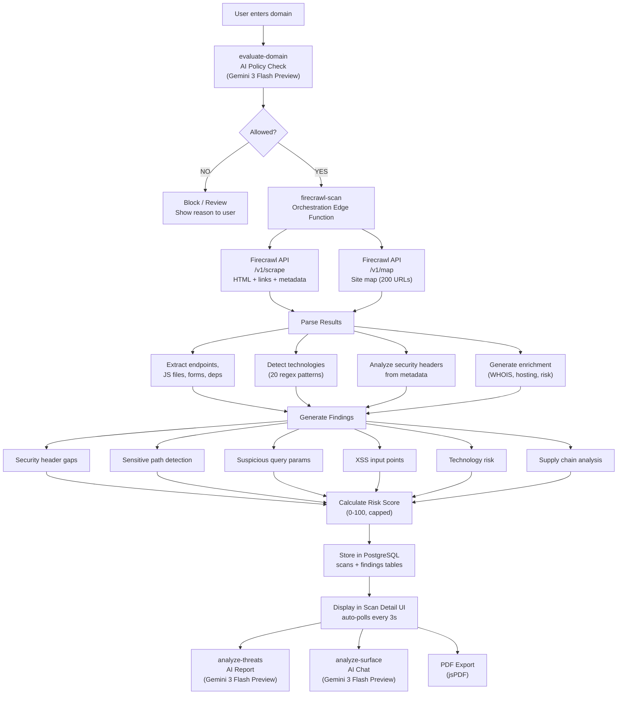

# ThreatLens — Technical Documentation

### Comprehensive Technical Reference

**By: Ritvik Induopuri**
**Date: February 25, 2026**

---

## Table of Contents

1. [Executive Summary](#1-executive-summary)
2. [System Architecture Deep Dive](#2-system-architecture-deep-dive)
   - 2.1 [High-Level Data Flow](#21-high-level-data-flow)
   - 2.2 [Routing & Protected Routes](#22-routing--protected-routes)
3. [Database Schema](#3-database-schema)
   - 3.1 [scans Table](#31-scans-table)
   - 3.2 [findings Table](#32-findings-table)
   - 3.3 [profiles Table](#33-profiles-table)
   - 3.4 [domain_policies Table](#34-domain_policies-table)
   - 3.5 [scan_audit_log Table](#35-scan_audit_log-table)
   - 3.6 [Entity Relationship Diagram](#36-entity-relationship-diagram)
4. [Edge Functions (Backend)](#4-edge-functions-backend)
   - 4.1 [Firecrawl Scan Pipeline](#41-firecrawl-scan-pipeline)
   - 4.2 [AI Threat Report Generator](#42-ai-threat-report-generator)
   - 4.3 [AI Surface Analyst (Chatbot & Insights)](#43-ai-surface-analyst-chatbot--insights)
   - 4.4 [AI Domain Policy Agent](#44-ai-domain-policy-agent)
5. [Firecrawl Web Scraping Process](#5-firecrawl-web-scraping-process)
   - 5.1 [Scraping Flow Diagram](#51-scraping-flow-diagram)
   - 5.2 [Data Extraction Details](#52-data-extraction-details)
6. [AI Integration](#6-ai-integration)
   - 6.1 [Models Used](#61-models-used)
   - 6.2 [AI Gateway Integration](#62-ai-gateway-integration)
7. [Frontend Components](#7-frontend-components)
   - 7.1 [Pages](#71-pages)
   - 7.2 [Core Components](#72-core-components)
   - 7.3 [UI Component Library](#73-ui-component-library)
8. [Authentication System](#8-authentication-system)
   - 8.1 [Auth Flow Diagram](#81-auth-flow-diagram)
   - 8.2 [Session Management](#82-session-management)
9. [Risk Scoring Algorithm](#9-risk-scoring-algorithm)
10. [PDF Export Engine](#10-pdf-export-engine)
11. [Design System & Styling](#11-design-system--styling)
    - 11.1 [CSS Token Architecture](#111-css-token-architecture)
    - 11.2 [Custom Utilities](#112-custom-utilities)
    - 11.3 [Typography](#113-typography)
12. [Security Architecture](#12-security-architecture)
13. [API Layer](#13-api-layer)
14. [Conclusion](#14-conclusion)

---

## 1. Executive Summary

ThreatLens is a full-stack cybersecurity platform that automates the process of domain reconnaissance, vulnerability detection, and threat intelligence reporting. The system ingests a target domain, crawls it using the Firecrawl API, parses the results for security-relevant data (endpoints, scripts, forms, headers, technologies), generates findings with severity ratings, calculates a composite risk score, and provides AI-powered analysis through both automated reports and an interactive chatbot.

The platform is designed with three core principles:
1. **Automation** — Minimize manual effort in security assessment
2. **Intelligence** — Leverage AI models for context-aware analysis
3. **Responsibility** — Prevent misuse via an AI domain policy gatekeeper

To understand how these principles translate into a working system, the next section dissects the architecture that ties the frontend, backend, and external services together into a unified pipeline.

---

## 2. System Architecture Deep Dive

The architecture of ThreatLens follows a three-tier model: a React single-page application on the client, serverless edge functions for compute, and PostgreSQL for persistence — all orchestrated through Lovable Cloud. This section walks through the data flow, component organization, and routing structure that make the platform work.

### 2.1 High-Level Data Flow



<p align="center"><em>Figure 1 — End-to-End Data Flow: From Domain Input to Intelligence Output</em></p>

**Step-by-step flow breakdown:**

1. **Domain Input** — The user enters a target domain into the `ScanForm` component on the dashboard.
2. **AI Policy Gate** — Before any crawling begins, the domain is sent to the `evaluate-domain` edge function, which uses Gemini Flash Lite to classify it as `allow`, `block`, or `review`.
3. **Block / Review Path** — If the domain is blocked or flagged for review, the scan is halted immediately. The user sees a toast notification explaining *why* the domain was rejected, with a "Go to Policies" button for manual override.
4. **Firecrawl Scrape** — For allowed domains, the `firecrawl-scan` edge function calls the Firecrawl `/v1/scrape` endpoint, requesting full HTML content, all hyperlinks, HTTP response metadata (headers), and a markdown representation of the page.
5. **Firecrawl Map** — A second call to `/v1/map` discovers up to 200 additional URLs across the site by following sitemaps and internal links. This call is non-blocking — if it fails, the pipeline continues with scrape data alone.
6. **Parsing Pipeline** — The raw data enters four parallel extraction paths:
   - **Endpoint extraction**: URLs are deduplicated, capped at 500, and filtered for JavaScript files, external dependencies (different hostname), and API-like endpoint patterns.
   - **Technology detection**: 20 regex patterns are matched against the raw HTML to identify frameworks, CDNs, CMSs, and analytics tools.
   - **Security header analysis**: 7 critical headers (CSP, HSTS, X-Frame-Options, X-Content-Type-Options, X-XSS-Protection, Referrer-Policy, Permissions-Policy) are checked from response metadata.
   - **Enrichment generation**: Simulated WHOIS data, hosting provider detection, and risk factor assessment are produced.
7. **Finding Generation** — The parsed data feeds into six finding categories: security header gaps, sensitive exposed paths (e.g., `/admin`, `/.env`, `/.git`), suspicious query parameters (e.g., `redirect`, `cmd`, `exec`), XSS input points (e.g., search/comment forms), technology risks (e.g., jQuery, WordPress), and supply chain vulnerabilities (excessive external dependencies).
8. **Risk Scoring** — Each finding is assigned a severity (critical/high/medium/low/info), and a composite risk score is calculated from the weighted sum: Critical = 25pts, High = 15pts, Medium = 8pts, Low = 3pts, Info = 1pt. The total is capped at 100.
9. **Database Persistence** — The scan record (with parsed data, technologies, enrichment) and all findings are written to the `scans` and `findings` PostgreSQL tables.
10. **Frontend Polling** — The Scan Detail page polls the database every 3 seconds until the scan status changes from `crawling`/`analyzing` to `completed` or `failed`.
11. **Output Paths** — From a completed scan, users can trigger three additional outputs:
    - **AI Threat Report** (`analyze-threats`) — A comprehensive, structured markdown report generated by Gemini Pro.
    - **Interactive AI Chat** (`analyze-surface`) — A conversational analyst chatbot powered by Gemini Flash.
    - **PDF Export** — A branded, paginated PDF document generated client-side with jsPDF.

With the data flow established, the next question is how routing and access control determine which parts of the UI a user can reach.

### 2.2 Routing & Protected Routes


<p align="center"><em>Figure 2 — Application Routing Map with Protected Route Guards</em></p>

**Step-by-step routing breakdown:**

1. **Route Registration** — React Router v6 defines all routes in `App.tsx`. Routes are split into two groups: public (no session required) and protected (session required).
2. **Public Routes** — `/auth` (the login/signup page) and `/*` (the 404 catch-all) are accessible without authentication.
3. **Protected Route Guard** — Every other route is wrapped in a `ProtectedRoute` component. If no session exists, it redirects the user to `/auth`.
4. **Auth Page Redirect** — The `/auth` route itself checks for an existing session on mount. If the user is already authenticated, they are redirected to `/` (the dashboard) to prevent accessing the login page when already signed in.
5. **Layout Wrapping** — Every protected route is wrapped with two higher-order components:
   - **`AppLayout`** — Renders the sticky glassmorphism header with navigation links (Dashboard, History, Compare, Policies), the ThreatLens logo, and the user avatar popover with sign-out functionality.
   - **`PageTransition`** — Applies Framer Motion fade + slide animations (0.25s duration, custom easing) for smooth visual transitions between pages.
6. **Route Parameters** — The `/scan/:id` route uses a dynamic URL parameter to load a specific scan by its UUID.

Now that we've seen how data flows through the system and how the client is organized, the next layer to examine is where all of this data lives — the PostgreSQL database schema that underpins every scan, finding, policy, and user profile.

---

## 3. Database Schema

The database is the backbone of ThreatLens, storing everything from raw crawl data to AI-generated reports. Five tables work together to support the scan lifecycle, vulnerability tracking, user management, domain policy enforcement, and audit logging. Each table is designed with specific JSONB columns to accommodate the flexible, deeply nested data structures that web scraping and AI analysis produce.

### 3.1 `scans` Table
The primary table storing all scan results. Every scan begins as a `crawling` record and progresses through `analyzing` to `completed` (or `failed`). The JSONB columns (`raw_crawl_data`, `parsed_data`, `enrichment`, `technologies`) store the full depth of scraping and analysis results without requiring rigid column definitions.

| Column | Type | Description |
|--------|------|-------------|
| `id` | UUID (PK) | Auto-generated scan identifier |
| `domain` | TEXT | Target domain that was scanned |
| `status` | TEXT | `crawling`, `analyzing`, `completed`, `failed` |
| `risk_score` | INTEGER | Composite risk score (0–100) |
| `urls_found` | INTEGER | Total number of URLs discovered |
| `vulnerabilities_found` | INTEGER | Total number of findings generated |
| `technologies` | JSONB | Array of detected technology names |
| `raw_crawl_data` | JSONB | Full Firecrawl response (`{ scrape, map }`) |
| `parsed_data` | JSONB | Structured data: `{ urls, jsFiles, forms, endpoints, externalDependencies, metadata, securityHeaders }` |
| `enrichment` | JSONB | `{ whois, hosting, riskFactors }` |
| `ai_report` | TEXT | AI-generated threat intelligence report (markdown) |
| `error_message` | TEXT | Error details if scan failed |
| `created_at` | TIMESTAMPTZ | Scan creation timestamp |
| `updated_at` | TIMESTAMPTZ | Last update timestamp |

### 3.2 `findings` Table
Each scan produces zero or more findings — individual vulnerability detections linked back to the parent scan via `scan_id`. Findings are the atomic units that feed into risk scoring, severity breakdowns, and AI analysis.

| Column | Type | Description |
|--------|------|-------------|
| `id` | UUID (PK) | Finding identifier |
| `scan_id` | UUID (FK → scans) | Parent scan reference |
| `title` | TEXT | Finding title |
| `description` | TEXT | Detailed description |
| `severity` | TEXT | `critical`, `high`, `medium`, `low`, `info` |
| `category` | TEXT | `Security Headers`, `Exposed Paths`, `Injection Points`, `XSS`, `Outdated Libraries`, `CMS Risk`, `Supply Chain` |
| `details` | JSONB | Additional structured details (header name, URL, recommendation, etc.) |
| `created_at` | TIMESTAMPTZ | Creation timestamp |

### 3.3 `profiles` Table
While scans and findings are shared across all users, the `profiles` table is the only user-specific table — it stores registration data from Google OAuth and serves as the registration gate that distinguishes signed-up users from anonymous Google account holders.

| Column | Type | Description |
|--------|------|-------------|
| `id` | UUID (PK) | Profile identifier |
| `user_id` | UUID (UNIQUE) | Auth user ID reference |
| `email` | TEXT | User's email address |
| `display_name` | TEXT | User's display name (from Google) |
| `avatar_url` | TEXT | Google avatar URL |
| `created_at` | TIMESTAMPTZ | Registration timestamp |

### 3.4 `domain_policies` Table
Before any scan executes, the domain must pass through a policy check. This table caches the results of AI evaluations and manual overrides so that repeat scans against the same domain don't require redundant AI calls.

| Column | Type | Description |
|--------|------|-------------|
| `id` | UUID (PK) | Policy identifier |
| `domain` | TEXT (UNIQUE) | Target domain (cleaned, lowercase) |
| `policy_type` | TEXT | `allow`, `block`, or `review` |
| `reason` | TEXT | Explanation for the policy decision |
| `ai_evaluated` | BOOLEAN | Whether AI made this decision (vs manual) |
| `created_at` | TIMESTAMPTZ | Creation timestamp |
| `updated_at` | TIMESTAMPTZ | Last update timestamp |

### 3.5 `scan_audit_log` Table
Every domain evaluation — whether served from the policy cache or freshly evaluated by AI — generates an immutable audit log entry. This table provides the accountability trail visible on the Policies page and is append-only by design.

| Column | Type | Description |
|--------|------|-------------|
| `id` | UUID (PK) | Log entry identifier |
| `domain` | TEXT | Domain that was evaluated |
| `action` | TEXT | `approved`, `blocked`, or `flagged` |
| `reason` | TEXT | Evaluation reason (prefixed with "Existing policy:" or "AI evaluation:") |
| `created_at` | TIMESTAMPTZ | Timestamp |

### 3.6 Entity Relationship Diagram

The following diagram shows how these five tables relate to each other. The only true foreign key relationship is between `scans` and `findings` — the other tables are logically connected through shared domain values and the scan lifecycle but remain structurally independent for flexibility and performance.


<p align="center"><em>Figure 1 — Database Entity Relationship Diagram</em></p>

**Step-by-step schema relationship breakdown:**

1. **`scans` → `findings` (one-to-many)** — Each scan record produces zero or more findings, linked by the `scan_id` foreign key on the `findings` table. When a scan is deleted, its findings must be deleted first (cascading delete handled in application code, not a DB cascade constraint).
2. **`profiles` (standalone)** — Stores user registration data keyed by `user_id`. This is the **only table with Row Level Security** restricted to the owning user — users can only read, insert, and update their own profile row. It has no foreign key to any other table.
3. **`domain_policies` → `scan_audit_log` (logical relationship)** — Every time a domain is evaluated (whether from the policy cache or via a fresh AI call), an entry is written to `scan_audit_log`. The relationship is logical (shared `domain` value), not enforced by a foreign key, because audit logs are append-only and must persist even if a policy is deleted.
4. **`scans` and `findings` (open access)** — These tables have open RLS policies, meaning all authenticated users can see all scan data. This is intentional — scan results are shared knowledge, not per-user private data.
5. **`domain_policies` (open access)** — Also open to all users, allowing anyone to view and manage the domain allowlist/blocklist. Manual overrides on this table directly affect which domains can be scanned.
6. **`scan_audit_log` (append-only)** — Open for SELECT and INSERT, but no UPDATE or DELETE policies. This ensures the audit trail is immutable — once a domain evaluation is logged, it cannot be modified or removed.

With the data model defined, the next question is: what code actually reads from and writes to these tables? That's the job of the four serverless edge functions that form ThreatLens's backend compute layer.

---

## 4. Edge Functions (Backend)

The backend logic lives entirely in four Deno-based edge functions deployed to Lovable Cloud. Each function serves a distinct role in the scan lifecycle: `firecrawl-scan` orchestrates the crawling and analysis pipeline, `analyze-threats` generates AI reports, `analyze-surface` powers the interactive chatbot, and `evaluate-domain` gates every scan request through the AI policy agent. Together, they transform a raw domain name into structured intelligence — reading from and writing to the database tables described above.

### 4.1 Firecrawl Scan Pipeline

**File**: `supabase/functions/firecrawl-scan/index.ts`

This is the core orchestration function that manages the entire scan lifecycle. It requires the `FIRECRAWL_API_KEY` secret and is the most complex of the four edge functions — handling everything from API calls to data parsing to finding generation in a single invocation.

#### Process Flow


<p align="center"><em>Figure 1 — Firecrawl Scan Pipeline: Complete Orchestration Flow</em></p>

**Step-by-step pipeline breakdown:**

1. **Scan Record Creation** — The function receives a domain (and optionally an existing `scanId`). If no `scanId` is provided, it creates a new scan record in the `scans` table with `status: crawling`. If a `scanId` is provided, it updates the existing record.
2. **URL Formatting** — The domain is normalized: if it doesn't start with `http://` or `https://`, `https://` is prepended to form a valid target URL.
3. **Firecrawl Scrape Call** — A POST request is sent to `https://api.firecrawl.dev/v1/scrape` with `formats: ['markdown', 'html', 'links']` and `onlyMainContent: false` (to capture the entire page, not just the main body content). The response contains raw HTML, discovered URLs, HTTP response metadata, and a markdown representation.
4. **Failure Check** — If the scrape call fails (network error, invalid domain, Firecrawl service down), the scan is immediately marked as `failed` with the error message stored in `error_message`, and the function returns early.
5. **Firecrawl Map Call** — On successful scrape, a second call is made to `https://api.firecrawl.dev/v1/map` with `limit: 200` to discover additional URLs across the site via sitemaps and internal link following. This call is wrapped in a try-catch — if it fails, the pipeline continues using only the scrape data (non-blocking).
6. **URL Merging & Deduplication** — Links from both the scrape response and the map response are combined into a single array, deduplicated using a `Set`, and capped at 500 URLs maximum.
7. **Seven-Step Parsing Phase** — The merged data is processed through seven parallel extraction functions:
   - **`detectTechnologies()`** — Matches 20 regex patterns against the raw HTML to identify frameworks, CDNs, CMSs, and analytics tools (see Technology Detection table below).
   - **JS File Extraction** — Filters URLs by file extension (`.js`, `.mjs`, `.jsx`, `.ts`, `.tsx`) to identify client-side scripts.
   - **`extractForms()`** — Uses regex to parse `<form>` tags from the HTML, extracting action URLs, HTTP methods, and input field names (capped at 20 forms).
   - **External Dependency Filtering** — Compares each URL's hostname against the target domain; different hostnames are classified as external dependencies (capped at 100).
   - **Endpoint Filtering** — Identifies URLs containing query parameters (`?`) or matching API-like patterns (`/api/`, `/graphql/`, `/v1/`, `/admin/`, etc.).
   - **`analyzeSecurityFromMeta()`** — Checks the Firecrawl metadata object for 7 security headers: CSP, HSTS, X-Frame-Options, X-Content-Type-Options, X-XSS-Protection, Referrer-Policy, and Permissions-Policy. Present values are stored; missing values are marked as `"Not Set"`.
   - **Enrichment Generation** — Produces simulated WHOIS data (registrar, creation date), hosting provider detection (based on IP/CDN patterns), and risk factor assessment.
8. **Status Update** — The scan record is updated to `status: analyzing` with all parsed data stored in the `parsed_data`, `technologies`, and `enrichment` JSONB columns.
9. **Finding Generation** — The `generateFindings()` function runs six categories of security checks against the parsed data (see Finding Generation Categories table below). Each check produces zero or more findings with a title, description, severity, category, and details object.
10. **Database Insertion** — All generated findings are batch-inserted into the `findings` table with the scan's `scan_id` as the foreign key.
11. **Risk Score Calculation** — The `calculateRiskScore()` function sums findings by weighted severity: Critical = 25pts, High = 15pts, Medium = 8pts, Low = 3pts, Info = 1pt. The raw total is capped at 100 using `Math.min(total, 100)`.
12. **Final Update** — The scan record is updated to `status: completed` with the final `risk_score`, `vulnerabilities_found` count, and `urls_found` count. The function returns the scan ID and summary metrics.

#### Technology Detection

The `detectTechnologies()` function uses regex pattern matching against the raw HTML to identify **20 technologies**:

| Technology | Detection Pattern |
|-----------|------------------|
| React | `react.production`, `reactDOM`, `__NEXT_DATA__` |
| Next.js | `__NEXT_DATA__`, `_next/` |
| Vue.js | `vue.js`, `__vue__` |
| Angular | `ng-version`, `angular.js` |
| jQuery | `jquery.js`, `jquery.min.js` |
| WordPress | `wp-content`, `wp-includes` |
| Bootstrap | `bootstrap.css`, `bootstrap.js` |
| Tailwind CSS | `tailwindcss`, `tailwind.css` |
| Google Analytics | `google-analytics`, `googletagmanager`, `gtag` |
| Google Tag Manager | `googletagmanager.com/gtm` |
| Cloudflare | `cloudflare`, `cf-ray`, `__cf_bm` |
| Nginx | `nginx` |
| PHP | `.php` |
| ASP.NET | `asp.net`, `__VIEWSTATE`, `__EVENTVALIDATION` |
| Shopify | `shopify.com`, `cdn.shopify` |
| Wix | `wix.com`, `parastorage.com` |
| Squarespace | `squarespace.com`, `sqsp.net` |
| Drupal | `drupal.js`, `drupal.settings` |
| HubSpot | `hubspot.com`, `hs-scripts` |
| Stripe | `stripe.com`, `stripe.js` |

#### Finding Generation Categories

| Category | Checks | Severity |
|----------|--------|----------|
| Security Headers | Missing CSP | High |
| Security Headers | Missing HSTS | Medium |
| Security Headers | Missing X-Frame-Options | Medium |
| Exposed Paths | Admin panels (`/admin`, `/wp-admin`, `/panel`, `/dashboard`) | High |
| Exposed Paths | Sensitive files (`/config`, `/.env`, `/.git`, `/backup`, `/dump`, `/sql`) | Critical |
| Exposed Paths | Database tools (`/phpmyadmin`, `/adminer`, `/phpinfo`) | Critical |
| Injection Points | Suspicious query params (`redirect`, `url`, `file`, `cmd`, `exec`, etc.) | High / Medium |
| XSS | Form inputs with text fields (`search`, `query`, `q`, `comment`, `message`) | Medium |
| Outdated Libraries | jQuery presence | Low |
| CMS Risk | WordPress detection | Medium |
| Supply Chain | >10 external dependencies | Low |

Once the scan pipeline completes and findings are stored, users can request deeper analysis. The next two edge functions handle that — generating comprehensive AI reports and powering the interactive chatbot.

### 4.2 AI Threat Report Generator

**File**: `supabase/functions/analyze-threats/index.ts`

Generates comprehensive enterprise-grade AI threat intelligence reports. While the scan pipeline handles automated detection, this function adds the layer of AI reasoning — interpreting findings in context, estimating CVSS scores, mapping to OWASP categories, and building a prioritized remediation roadmap.

**Input**: `{ scanId }` → Fetches scan + findings from database using service role key

**AI Model**: `google/gemini-3-flash-preview` via Lovable AI Gateway (`https://ai.gateway.lovable.dev`)

**AI Prompt Structure**:
- System role: Principal Cybersecurity Analyst at a Fortune 500 firm
- Data provided: Full scan metadata, severity counts, category breakdown, technologies, enrichment (WHOIS, hosting, risk factors), security headers, all findings with details, attack surface metrics
- Output format: 11-section structured markdown report:
  1. Executive Summary
  2. Scope & Methodology
  3. Critical & High-Severity Findings (with CVSS estimates, CWE/OWASP refs)
  4. Medium & Low-Severity Findings (table format)
  5. Attack Surface Analysis (endpoints, tech stack, dependencies, forms)
  6. Security Headers Assessment
  7. Infrastructure & Hosting Analysis
  8. Remediation Roadmap (immediate → long-term)
  9. Compliance Considerations (GDPR, PCI-DSS, SOC 2)
  10. Risk Assessment Overview (with risk matrix)
  11. Conclusion

**Post-generation**: Report is stored in the `scans.ai_report` column.

**Error handling**: Returns specific error codes for rate limiting (429) and credit exhaustion (402).

The threat report provides a one-shot comprehensive analysis, but users often need to ask follow-up questions or drill into specific areas. That's where the interactive AI analyst comes in.

### 4.3 AI Surface Analyst (Chatbot & Insights)

**File**: `supabase/functions/analyze-surface/index.ts`

Powers both the interactive AI chatbot (`AiChatPanel`) and the one-click AI analysis buttons (`AiSurfaceInsight`). Unlike the threat report generator which produces a single monolithic report, this function is designed for targeted, conversational analysis — handling **7 different section types** with tailored prompts that focus on specific aspects of the scan data:

| Section | Source Component | Context Data | Analysis Focus |
|---------|-----------------|-------------|----------------|
| `security_headers` | `AiSurfaceInsight` | Header config object | Per-header risk assessment, exact remediation values |
| `endpoints` | `AiSurfaceInsight` | Discovered URLs (max 40) | Endpoint classification, high-risk paths, recon insights |
| `dependencies` | `AiSurfaceInsight` | External deps (max 30) | Supply chain risk, privacy concerns, Magecart scenarios |
| `raw_data` | `AiSurfaceInsight` | Raw crawl JSON (truncated 12KB) | Infrastructure overview, app fingerprint, data exposure |
| `surface_chat` | `AiChatPanel` (surface tab) | Full surface data + question | Free-form attack surface Q&A |
| `findings_chat` | `AiChatPanel` (findings tab) | All findings + question | Severity prioritization, remediation guidance |
| `raw_data_chat` | `AiChatPanel` (raw data tab) | Raw crawl data + question | Data interpretation and contextualization |

**AI Model**: `google/gemini-3-flash-preview` via Lovable AI Gateway

**System prompt**: Principal Cybersecurity Analyst specializing in web app security, pen testing, and threat intelligence. References OWASP, CWE, MITRE ATT&CK.

Before any of these analysis functions can run, though, the domain must first be approved. The fourth and final edge function acts as the gatekeeper that decides whether a scan should proceed at all.

### 4.4 AI Domain Policy Agent

**File**: `supabase/functions/evaluate-domain/index.ts`

The gatekeeper function that evaluates every scan request before execution. This is the first edge function called in any scan workflow — if it blocks the domain, none of the other functions ever fire.


<p align="center"><em>Figure 2 — AI Domain Policy Agent: Evaluation Decision Flow</em></p>

**Step-by-step policy evaluation breakdown:**

1. **Domain Cleaning** — The input domain is normalized: converted to lowercase, and any protocol prefix (`https://`, `http://`) or trailing path (`/page/about`) is stripped, leaving only the bare hostname (e.g., `example.com`).
2. **Cache Check** — The function queries the `domain_policies` table for an existing policy matching the cleaned domain.
3. **Cache Hit Path** — If a policy already exists (either from a previous AI evaluation or a manual override), it is returned immediately without making any AI call. An audit log entry is written to `scan_audit_log` with the prefix `"Existing policy:"` followed by the cached reason.
4. **AI Evaluation (Cache Miss)** — For unknown domains, the function sends a classification request to **Gemini 3 Flash Preview** via the Lovable AI Gateway. The prompt defines three categories:
   - **ALLOW** — Public websites, businesses, SaaS products, educational institutions (`.edu`), open-source projects, news sites, and personal sites.
   - **BLOCK** — Military domains (`.mil`), intelligence agencies, critical infrastructure (power grids, water systems), healthcare patient portals, core banking systems, and law enforcement honeypots.
   - **REVIEW** — Ambiguous or sensitive targets, small government agencies, suspicious TLDs (`.onion`, `.tk`), and private-looking internal domains.
5. **AI Response Parsing** — The AI response is expected to be a JSON object with `policy` (`"allow"`, `"block"`, or `"review"`) and `reason` (a human-readable explanation). The function attempts to parse this from the response text.
6. **Parse Failure Fallback** — If the AI response cannot be parsed as valid JSON (malformed output, unexpected format), the function defaults to `review` with a descriptive error reason explaining what went wrong — e.g., `"AI evaluation returned an unparseable response. Please review this domain manually."`.
7. **HTTP Error Handling** — Specific HTTP error codes produce specific fallback reasons:
   - **429 (Rate Limited)** — `"The AI evaluation service is temporarily rate-limited. Please try again shortly or approve this domain manually."`
   - **402 (Credits Exhausted)** — `"AI evaluation credits have been exhausted. Please approve this domain manually."`
   - **Other errors** — Include the HTTP status code in the reason for debugging.
8. **Policy Storage** — The resulting policy (whether from AI or fallback) is inserted into the `domain_policies` table with `ai_evaluated: true` (or `false` for manual overrides done through the Policies page).
9. **Audit Logging** — An entry is written to `scan_audit_log` with the action (`approved`, `blocked`, or `flagged`) and the full reason text, prefixed with `"AI evaluation:"`.
10. **Output** — The function returns a JSON response with `allowed` (boolean), `policy` (the policy type string), `reason` (the explanation), and `ai_evaluated` (whether AI made the decision).

The edge functions above reference Firecrawl API calls extensively but only at a high level. The next section zooms into the scraping process itself — the specific API endpoints, request parameters, response structures, and data extraction logic that turn a domain name into structured security data.

---

## 5. Firecrawl Web Scraping Process

Firecrawl is the data acquisition engine at the heart of ThreatLens. The `firecrawl-scan` edge function uses two Firecrawl API endpoints — `/v1/scrape` for deep single-page extraction and `/v1/map` for broad site-wide URL discovery. This section details exactly what data is requested, what comes back, and how it's parsed into the structured format stored in the database.

### 5.1 Scraping Flow Diagram


<p align="center"><em>Figure 1 — Firecrawl Web Scraping Pipeline: Two-Phase Data Acquisition and Parsing</em></p>

**Step-by-step scraping breakdown:**

1. **Phase 1: Scrape Request** — The target URL is sent to Firecrawl's `/v1/scrape` endpoint with three requested formats: `markdown` (for readable page content), `html` (for raw DOM parsing), and `links` (for discovered hyperlinks). The `onlyMainContent: false` flag ensures the entire page is captured — including navigation bars, footers, sidebars, and hidden elements that may reveal security-relevant information.
2. **Scrape Response** — Firecrawl returns a data object containing:
   - `data.html` — The complete raw HTML of the page
   - `data.links` — An array of all discovered URLs (internal and external links found on the page)
   - `data.metadata` — HTTP response headers including security headers, content type, and server information
   - `data.markdown` — A markdown representation of the page content
3. **Phase 2: Map Request** — A second request is sent to `/v1/map` with `limit: 200` to discover additional URLs beyond the initial page. This endpoint follows sitemaps, internal links, and crawl paths to build a broader picture of the site's URL structure.
4. **Map Response (Non-Blocking)** — The map endpoint returns an array of discovered URLs. This call is wrapped in a try-catch — if it fails (timeout, rate limit, unsupported site), the pipeline continues with scrape data alone. No data is lost; the map simply provides additional URL coverage.
5. **URL Deduplication** — URLs from both sources (`scrape.links` + `map.links`) are merged into a single array and deduplicated using a `Set` to remove exact duplicates. The final list is capped at 500 URLs to prevent excessive data in the database.
6. **URL-Based Extraction** — From the merged URL list, three categories are filtered:
   - **JavaScript files** — URLs ending in `.js`, `.mjs`, `.jsx`, `.ts`, or `.tsx` are classified as client-side scripts that may expose API keys, internal routes, or business logic.
   - **External dependencies** — URLs whose hostname differs from the target domain are classified as third-party resources representing supply chain risk.
   - **Endpoints** — URLs containing query parameters (`?`) or matching API-like patterns (`/api/`, `/graphql/`, `/v1/`, `/admin/`, `/login/`, etc.) are classified as interactive endpoints.
7. **HTML-Based Extraction** — From the raw HTML, two categories are extracted:
   - **Forms** — Regex parsing identifies `<form>` tags, extracting action URLs, HTTP methods, and input field names. Capped at 20 forms to prevent data bloat.
   - **Technologies** — 20 regex patterns are matched against the HTML source to detect frameworks (React, Vue, Angular), CMSs (WordPress, Drupal), CDNs (Cloudflare), analytics (Google Analytics, GTM), and more.
8. **Metadata-Based Extraction** — From the Firecrawl response metadata, 7 critical security headers are checked. For each header, the present value is stored; missing headers are marked as `"Not Set"` — these missing headers become findings in the next pipeline stage.

### 5.2 Data Extraction Details

**Endpoint Filtering**: URLs containing `?` (query params) or matching API patterns:
```regex
/(api|graphql|rest|v\d|admin|login|dashboard|wp-|config)/i
```

**Form Extraction**: Regex-based HTML parsing:
```regex
/<form[^>]*action=["']?([^"'\s>]*)["']?[^>]*method=["']?([^"'\s>]*)["']?[^>]*>([\s\S]*?)<\/form>/gi
```
Extracts: action URL, HTTP method, input field names (capped at 20 forms).

**External Dependency Detection**: Compares each URL's hostname against the target domain — different host = external dependency (capped at 100).

**Security Header Analysis**: Reads from Firecrawl metadata object. Each of 7 headers is checked — present values stored, missing values marked as `"Not Set"`.

Firecrawl provides the raw data, but it takes AI to turn that data into actionable intelligence. The next section covers how ThreatLens integrates with multiple AI models through a unified gateway, and why different functions use different models.

---

## 6. AI Integration

All three AI-powered edge functions use the **Lovable AI Gateway** (`https://ai.gateway.lovable.dev/v1/chat/completions`) for inference. No user API keys are required — the `LOVABLE_API_KEY` environment variable is auto-provisioned by Lovable Cloud. This unified gateway approach means all AI calls follow the same OpenAI-compatible API pattern, differing only in the model selected and the prompt constructed.

### 6.1 Models Used

As of February 2026, ThreatLens has been upgraded to use a **single unified model** across all three AI-powered edge functions: **`google/gemini-3-flash-preview`**. This is Google's next-generation Flash model, offering a strong balance of speed and capability that eliminates the need for a multi-model strategy. All functions — from simple domain classification to comprehensive threat reports — now use the same model, simplifying the codebase and ensuring consistent quality across all AI outputs.

| Function | Model | Use Case |
|----------|-------|----------|
| Domain Policy Evaluation | `google/gemini-3-flash-preview` | JSON classification (allow/block/review) |
| Threat Report Generation | `google/gemini-3-flash-preview` | Long-form structured markdown report with CVE/OWASP references |
| Interactive Chat & Surface Analysis | `google/gemini-3-flash-preview` | Multi-turn context-aware security analysis |


<p align="center"><em>Figure 1 — Unified AI Model Strategy: All Functions Use Gemini 3 Flash Preview</em></p>

**Step-by-step model strategy breakdown:**

1. **Unified Model Choice** — All three edge functions now use `google/gemini-3-flash-preview`, Google's next-generation Flash model. This simplifies the codebase by eliminating the need to select different models for different tasks — a single model string is used across the entire backend.
2. **`evaluate-domain`** — Performs domain classification (allow/block/review) by sending a structured prompt and expecting a JSON response. Gemini 3 Flash Preview handles this lightweight task with sub-second latency while maintaining high classification accuracy.
3. **`analyze-threats`** — Generates comprehensive, multi-section markdown reports requiring deep reasoning: CVSS score estimation, CWE/OWASP mapping, compliance assessment (GDPR, PCI-DSS, SOC 2), and prioritized remediation roadmaps. Gemini 3 Flash Preview delivers sufficient depth and accuracy for these complex outputs.
4. **`analyze-surface`** — Powers the interactive chatbot and one-click surface analysis. Users expect conversational response times when asking follow-up questions, and the model delivers substantive security analysis referencing OWASP, CWE, and MITRE ATT&CK frameworks with low latency.
5. **Unified Gateway** — All three functions access the model through the same Lovable AI Gateway endpoint (`https://ai.gateway.lovable.dev/v1/chat/completions`) using the same OpenAI-compatible request format. The only variable is the prompt — the `model` field is identical across all calls.

### 6.2 AI Gateway Integration

All edge functions use the same integration pattern:

```
Edge Function
  → POST https://ai.gateway.lovable.dev/v1/chat/completions
  → Headers: Authorization: Bearer ${LOVABLE_API_KEY}
  → Body: {
      model: "google/gemini-3-flash-preview",
      messages: [
        { role: "system", content: "..." },
        { role: "user", content: "..." }
      ]
    }
  → Response: { choices: [{ message: { content: string } }] }
```

**Authentication**: Uses `LOVABLE_API_KEY` environment variable (auto-provided by Lovable Cloud). This key is managed automatically — users never need to configure it.

**Error Handling**: All functions handle three error states:
- **429 Too Many Requests** — Rate limited; returns descriptive message to user
- **402 Payment Required** — Credits exhausted; surfaces billing guidance
- **Network/Parse errors** — Falls back gracefully with explanatory messages

The backend is only half the story — all of this data and AI analysis needs to be presented to the user through an intuitive interface. The next section covers the frontend components that render scans, findings, reports, and interactive analysis into a cohesive user experience.

---

## 7. Frontend Components

The React frontend is organized into seven page components and eight core components, all rendered within a shared layout that provides navigation, authentication state, and page transition animations. Each page maps to a specific step in the user workflow — from authentication to scanning to analysis to comparison — and leverages the API layer (covered in Section 13) to communicate with the backend.

### 7.1 Pages

#### `Auth.tsx` — Authentication
The entry point for all new and returning users. This page handles the full Google OAuth lifecycle:
- Tab-based Sign In / Sign Up UI with custom tab switcher (not shadcn tabs)
- Google OAuth via `lovable.auth.signInWithOAuth("google")`
- `auth_intent` stored in localStorage to distinguish signup vs signin after OAuth redirect
- Profile-based registration gate:
  - **Sign Up**: Creates a `profiles` row with `user_id`, email, display_name, avatar_url from Google metadata
  - **Sign In**: Checks for existing profile → rejects with "No account found" if missing
- Unauthorized users signed out with error toast
- Animated background with radial gradient

#### `Index.tsx` — Dashboard
Once authenticated, users land on the dashboard — the operational hub that provides an at-a-glance overview of scanning activity and serves as the primary entry point for new scans:
- Animated hero section with 3 concentric pulsing radar rings (Framer Motion)
- ThreatLens logo with pulse ring animation
- `ScanForm` component for domain input
- Stats grid (4 cards): Total Scans, Unique Domains, Vulnerabilities, Avg Risk
  - Avg Risk calculated only from **completed** scans (excludes failed/in-progress)
- Recent scans list (last 5) with staggered entry animations
- Risk distribution sidebar — scans bucketed by risk score ranges (≥75 critical, ≥50 high, ≥25 medium, >0 low, 0 info)
- Technology fingerprint cloud — top 8 technologies across all scans with occurrence counts

<p align="center">
  
</p>
<p align="center"><em>Figure 1 — Dashboard — Hero section with scan form, stats grid, recent scans, risk distribution, and technology cloud</em></p>

The most complex page in the application — where the bulk of scan intelligence is consumed. Users navigate here after initiating a scan or clicking a scan from the dashboard/history. It's organized into **four tabs** that separate concerns:

**Header area** (always visible):
- Domain name, status badge, scan timestamp
- Refresh, Export PDF, Generate AI Report buttons
- Progress card for in-progress scans (crawling/analyzing) with 3-second auto-poll interval
- Error card for failed scans with error message

**Stats row** (completed scans):
- 5 stat cards with tooltips: Risk Score (with scoring formula tooltip), URLs Found, Vulnerabilities, Technologies, JS Files
- Severity determination guide (Critical/High/Medium/Low definitions)
- Domain enrichment panel (WHOIS registrar, hosting provider, ASN, surface size)

**Tab 1: Findings**
- AI Chat Panel (findings context)
- Finding cards with severity badge, category label, title, description
- Staggered entry animations
- Shield icon when no findings detected

<p align="center">
  
</p>
<p align="center"><em>Figure 2 — Scan Detail — Header stats, severity guide, domain enrichment, and Findings tab with severity-coded finding cards</em></p>

**Tab 2: Attack Surface**
- Attack Surface Summary table (5 rows: Security Headers, Endpoints, External Deps, JS Files, Input Vectors) with count, status, and risk implication
- AI Chat Panel (surface context)
- 4 clickable stat cards that scroll to detail sections (with tooltips explaining security implications)
- Technology Stack display (chips with primary styling)
- Security Headers table (green dot = set, red dot = missing, truncated values)
- Discovered Endpoints scrollable list
- JS Files and Forms side-by-side grid
- External Dependencies scrollable list

<p align="center">
  
</p>
<p align="center"><em>Figure 3 — Attack Surface tab — Summary table, AI Threat Analyst chat with per-header analysis, and stat cards</em></p>

<p align="center">
  
</p>
<p align="center"><em>Figure 4 — Attack Surface tab — Technology stack, security headers table (red = missing), and discovered endpoints</em></p>

**Tab 3: AI Report**
- Generate button (if no report exists)
- Rendered markdown report with `renderMarkdown()` parser
- Copy Report and Download PDF buttons

**Tab 4: Raw Data**
- AI Chat Panel (raw_data context)
- Full raw crawl data displayed as formatted JSON in a scrollable `<pre>` block

<p align="center">
  
</p>
<p align="center"><em>Figure 5 — Raw Data tab — AI Threat Analyst providing intelligence briefing on raw crawl data, with JSON viewer below</em></p>

#### `History.tsx` — Scan History
While the dashboard shows the 5 most recent scans, the History page provides a complete chronological view with management capabilities:
- Chronological list of all scans
- Each scan shows: domain, timestamp, URL count, findings count, status badge, risk score
- Delete button with AlertDialog confirmation
- Cascading delete: findings first, then scan record
- Staggered entry animations

#### `Compare.tsx` — Scan Comparison
For organizations scanning the same domain periodically, the Compare page enables structured delta analysis between any two completed scans. It is designed to give analysts an immediate, actionable view of what changed between scan intervals.

**Scan Selection**:
- Two Select dropdowns filter to completed scans only, with mutual exclusion (can't compare a scan with itself)
- Each selector card displays rich metadata once chosen: domain, exact scan timestamp, risk score, finding count, endpoint count, and technology count — so analysts can confirm they've selected the right pair before reviewing the diff
- Parallel data loading with `Promise.all` fetches both scan records and their findings simultaneously

**Executive Summary** (4-card grid):
- **Risk Score** — A → B with delta indicator (green = improvement, red = regression)
- **Findings** — Total vulnerability count with directional delta
- **Endpoints** — Discovered URL count with inverted delta logic (more = larger attack surface)
- **Technologies** — Stack size with inverted delta logic
- Each card includes an info tooltip explaining what the metric means for the analyst

**Risk Score Change** (detailed):
- Color-coded risk level cards for both scans (Critical ≥75, High ≥50, Medium ≥25, Low <25) with large numeric display
- Prominent delta indicator with contextual label: "RISK INCREASED" (red), "RISK DECREASED" (green), or "NO CHANGE"
- **What Drove This Change** — Auto-generated plain-language explanation listing severity-level shifts (e.g., "2 new critical findings detected", "1 high finding no longer detected")
- **How to Read This** — Inline explainer showing the scoring formula (`Critical×25 + High×15 + Medium×8 + Low×3 + Info×1`, capped at 100) with a contextual interpretation of the delta direction
- **Severity Breakdown** — Per-severity bar chart comparison (critical → info), showing A and B counts side-by-side with progress bars and delta indicators. Allows analysts to see whether the risk shift is driven by new critical findings or just informational noise

**Finding Delta** (3-column card):
- **Newly Detected** — Findings present in the current scan but absent from the baseline, shown with severity badge, title, and category, highlighted with an "Investigate" tag. Contextual note explains these represent new attack vectors or previously hidden surfaces
- **No Longer Detected** — Findings present in the baseline but absent from the current scan. Explicitly noted as *not confirmed remediation* — the target may have patched, reconfigured, added authentication, or the finding may be intermittent
- **Still Present** — Findings detected in both scans, indicating the target's attack surface still exposes these weaknesses
- Matching logic: findings are diffed by title (exact string match)
- Each finding card shows both severity badge and category label for faster triage
- This terminology deliberately avoids "resolved" or "unresolved" since the app performs passive reconnaissance, not vulnerability management

**Technology Stack Changes**:
- Grouped into three labeled sections: Added (green + border), Removed (red − border), Unchanged (neutral chips)
- Contextual description explains that added technologies expand the attack surface while removed ones may indicate decommissioning

**Endpoint Changes** (2-column grid):
- **New Endpoints** — URLs in B but not A, described as "potential new attack vectors", capped at 30 with "+N more" overflow
- **Removed Endpoints** — URLs in A but not B, described as "possibly decommissioned services"
- **Unchanged summary** — Footer line showing how many endpoints are stable between scans

**AI Analyst Chatbot** (compare context):
- An `AiChatPanel` instance is rendered at the bottom of the comparison view, scoped to the `compare` context
- Context data passed includes both scan summaries, the full finding delta (newly detected, no longer detected, still present), technology diff, and endpoint counts
- Suggested questions: "Explain the risk score change in plain language", "What are the most concerning newly detected findings?", "Has the attack surface expanded or contracted?", "What infrastructure changes should the analyst investigate?"
- The `compare_chat` handler in the `analyze-surface` edge function is instructed to respect passive recon semantics — it will never claim a finding is "fixed" just because it's no longer detected
- Uses `google/gemini-3-flash-preview` via the Lovable AI Gateway

<p align="center">
  
</p>
<p align="center"><em>Figure 6 — Scan Comparison — Executive summary, risk score change with scoring formula explainer, and per-severity breakdown</em></p>

<p align="center">
  
</p>
<p align="center"><em>Figure 7 — Scan Comparison — Technology stack changes, new/removed endpoint lists, and AI Threat Analyst chatbot demonstrating domain mismatch detection, MITRE ATT&CK / CWE references, and principal remediation recommendations</em></p>


#### `Policies.tsx` — Domain Policy Management
This page is the human override layer on top of the AI policy agent — allowing administrators to manually approve, block, or flag domains, and review the full audit trail:
- Stats row (4 cards): Allowed, Blocked, Under Review, AI Evaluated counts
- Manual policy addition form: domain input, policy type selector, optional reason, Add button
- Domain cleaning on add: lowercase, strip protocol/path
- Duplicate detection with user-friendly error message
- Policy list with hover-reveal controls:
  - Policy type badge (color-coded: green/red/amber)
  - Inline type changer (Select dropdown, opacity-0 until hover)
  - Delete button (opacity-0 until hover)
  - AI-evaluated bot icon indicator
- Audit log (last 50 entries): color-coded action dots, domain, reason, action badge, timestamp

<p align="center">
  
</p>
<p align="center"><em>Figure 8 — Domain Policies — Stats cards, manual policy form, policy list with AI-evaluated indicators, and immutable audit log</em></p>

#### `NotFound.tsx` — 404 Page
- Centered layout with "404" heading, "Page not found" message, and link back to home
- Logs 404 errors to console with the attempted pathname

### 7.2 Core Components

Beyond the page components, several reusable components provide shared functionality across multiple pages. These handle everything from domain input to AI interaction to data visualization.

#### `AiChatPanel.tsx`
The interactive AI analyst interface that appears on the ScanDetail page — providing conversational access to the `analyze-surface` edge function:
- Collapsible chat interface — starts as a button, expands to full card panel
- Three context modes: `surface`, `findings`, `raw_data` with distinct labels
- Suggested question chips (4 per context) for quick one-click analysis
- Message history with user (right-aligned) / assistant (left-aligned) styling
- **Markdown renderer** (`renderMarkdown()` — exported function) supporting:
  - Bold text (`**text**`) via inline parser
  - Headers (`##`, `###`, `####`) with styled borders
  - Bullet lists (`-`, `*`) with primary-colored dots
  - Nested bullet lists (indented `-`, `*`) with secondary dots
  - Numbered lists
  - **Tables** — full parser that detects header + separator + data rows, renders styled `<table>` with hover rows
  - Code blocks (``` delimited) with monospace styling
  - Blockquotes (`>`) with left border accent
  - Horizontal rules (`---`)
- Copy-to-clipboard button on every AI response
- Send button + Enter key submission
- Loading state with "Analyzing..." spinner

#### `AiSurfaceInsight.tsx`
Complements the chatbot with one-click AI analysis for specific attack surface sections:
- Supports 4 section types: `security_headers`, `endpoints`, `dependencies`, `raw_data`
- Renders analysis results inline with basic markdown parsing (headers, bold, bullets, numbered lists)
- Calls `onAnalysis` callback to pass results up to ScanDetail for PDF inclusion

#### `ScanForm.tsx`
The domain input component used on both the Dashboard and (implicitly) in the scan workflow:
- Domain input with Globe icon prefix
- Two-phase submit flow:
  1. `evaluateDomain()` — checks AI policy agent
  2. `startScan()` — only if domain is allowed
- Policy status badge (green = allow, red = block, amber = review) with AI reasoning text
- Blocks scan if domain is blocked or under review (shows destructive toast with "Go to Policies" action button)
- Navigates to `/scan/{scanId}` on success

#### `AuthProvider.tsx`
The authentication context that wraps the entire application:
- React context providing `session`, `loading`, and `signOut`
- Sets up `onAuthStateChange` listener **before** calling `getSession()` (proper Supabase pattern to avoid race conditions)
- Provides context to entire app via `useAuth()` hook

#### `RiskScoreBreakdown.tsx`
A detailed visualization of how a scan's risk score was calculated:
- Large score display with color-coded text (Critical/High/Medium/Low)
- Progress bar visualization with animated width
- **Bar chart**: Severity contributions as proportional vertical bars with raw point labels
- Contribution breakdown: Each active severity level showing count × weight = points
- "Raw total capped at 100" note when score exceeds cap
- Severity definitions grid (4 categories with descriptions)
- Collapsible scoring formula details (`<details>` element)

#### `SeverityBadge.tsx` — Three exports:
1. **SeverityBadge**: Icon + label badge (ShieldAlert/AlertTriangle/Shield/ShieldCheck/Info) with severity-specific colors and border
2. **RiskScoreGauge**: Large score number + risk label + animated progress bar
3. **StatusBadge**: Scan status label (pending/crawling/analyzing/completed/failed) with `animate-pulse-glow` for active states

#### `PageTransition.tsx`
Provides smooth visual transitions between pages using Framer Motion:
- `PageTransition` component: AnimatePresence wrapper with fade + slide animations (0.25s, custom easing)
- Exported animation variants:
  - `staggerContainer`: Staggers children by 0.06s
  - `fadeInUp`: Opacity 0→1, y 16→0 (0.35s)
  - `scaleIn`: Opacity 0→1, scale 0.95→1 (0.3s)

#### `NavLink.tsx`
- Wrapper around React Router's `NavLink` with `className`/`activeClassName`/`pendingClassName` support via the `cn()` utility
- Forwarded ref support

### 7.3 UI Component Library

Built on **shadcn/ui** with Radix primitives. Key components actively used:
- `Card`, `CardContent`, `CardHeader`, `CardTitle` — primary layout containers
- `Tabs`, `TabsList`, `TabsTrigger`, `TabsContent` — ScanDetail tab navigation
- `Badge` — policy type labels in Policies page
- `Button` — actions throughout (multiple variants: default, outline, ghost)
- `Input` — domain entry, policy forms
- `Select`, `SelectTrigger`, `SelectContent`, `SelectItem` — scan comparison selectors, policy type pickers
- `AlertDialog` — scan delete confirmation with destructive action styling
- `Tooltip`, `TooltipProvider`, `TooltipTrigger`, `TooltipContent` — stat card explanations, metric tooltips
- `Popover`, `PopoverContent`, `PopoverTrigger` — user avatar menu in header
- `Avatar`, `AvatarImage`, `AvatarFallback` — user profile display with initial fallback
- `Progress` — risk score bars (used in RiskScoreBreakdown)

The frontend components above rely on an authenticated session to function — the `AuthProvider` context, the `ProtectedRoute` wrapper, and the profile-based registration gate all work together to ensure only registered users can access the platform. The next section dives deeper into exactly how that authentication system works end-to-end.

---

## 8. Authentication System

Authentication is the first thing a user encounters and the last line of defense against unauthorized access. ThreatLens uses Google OAuth through Lovable Cloud, but adds a custom **profile-based registration gate** on top — meaning that having a Google account alone isn't enough to access the platform. Users must explicitly sign up, which creates a `profiles` row, before they can sign in on subsequent visits.

### 8.1 Auth Flow Diagram


<p align="center"><em>Figure 1 — Authentication Flow: Google OAuth with Profile-Based Registration Gate</em></p>

**Step-by-step authentication breakdown:**

1. **App Load** — When the user visits any page, the `AuthProvider` component (which wraps the entire app) initializes by setting up an `onAuthStateChange` listener and then calling `getSession()`. The listener is registered *before* `getSession()` to avoid race conditions where a session change event fires before the listener is ready.
2. **Session Check** — If a valid session exists (the user is already logged in), all protected routes render normally. The user sees the dashboard, scan detail, history, etc.
3. **No Session → Redirect** — If no session exists, the `ProtectedRoute` wrapper intercepts the route render and redirects the user to `/auth`.
4. **Auth Page Display** — The user sees a tab-based UI with "Sign In" and "Sign Up" tabs. Both tabs display a "Continue with Google" button, but the tab choice determines what happens *after* the OAuth flow.
5. **Intent Storage** — Before initiating the OAuth redirect, the app stores `auth_intent` ("signin" or "signup") in `localStorage`. This is critical because the Google OAuth redirect causes a full page reload, losing all React state — `localStorage` persists across the redirect.
6. **OAuth Redirect** — The app calls `lovable.auth.signInWithOAuth("google")` with a `redirect_uri` pointing back to the app. The user is redirected to Google's consent screen.
7. **Google Consent** — The user authenticates with Google and grants permissions. Google redirects back to the app with auth tokens in the URL hash.
8. **Session Established** — The `onAuthStateChange` listener fires with the new session containing the user's Google metadata (email, display name, avatar URL, user ID).
9. **Post-Auth Handler** — The `handlePostAuth()` function runs, checking the `profiles` table for a row matching the user's `user_id`.
10. **Profile Exists (Returning User)** — If a profile row exists, the user is navigated to the dashboard (`/`) regardless of whether they clicked "Sign In" or "Sign Up". The `auth_intent` is cleared from `localStorage`.
11. **No Profile + Signup Intent (New User)** — If no profile exists and `auth_intent === "signup"`, a new row is inserted into the `profiles` table with the user's `user_id`, `email`, `display_name`, and `avatar_url` extracted from `session.user.user_metadata`. After successful insertion, the user is navigated to the dashboard.
12. **No Profile + Signin Intent (Rejected)** — If no profile exists and `auth_intent === "signin"` (or is missing), the user is immediately signed out via `supabase.auth.signOut()`, and a destructive toast displays "No account found. Please sign up first." This prevents unregistered users from accessing the platform even if they have a valid Google account.

### 8.2 Session Management

- **AuthProvider** creates a React context with `session`, `loading`, `signOut`
- `onAuthStateChange` is registered before `getSession()` per Supabase best practices
- `signOut()` calls `supabase.auth.signOut()` and clears session state to `null`
- Session is checked on every protected route via `ProtectedRoute` wrapper
- User avatar + email shown in header Popover (from `session.user.user_metadata`)
- Loading spinner shown while auth state is being determined

Once authenticated, users interact with scan results — and the most prominent metric they encounter is the risk score. The next section explains exactly how that score is calculated from individual findings.

---

## 9. Risk Scoring Algorithm

Every completed scan produces a single composite risk score between 0 and 100. This score serves as the primary metric across the platform — it's displayed on the dashboard, in scan history, on the detail page, in comparisons, and in PDF reports. The algorithm is intentionally simple and transparent, so users can understand exactly why a domain received its score.

### Scoring Formula


<p align="center"><em>Figure 1 — Risk Score Calculation: Weighted Severity Sum Capped at 100</em></p>

**Step-by-step scoring breakdown:**

1. **Collect All Findings** — After the finding generation phase completes, all findings for the scan are retrieved from the `findings` table.
2. **Group by Severity** — Findings are grouped into five severity buckets: `critical`, `high`, `medium`, `low`, and `info`.
3. **Apply Weights** — Each severity level has a fixed point value reflecting its potential impact:
   - **Critical** = 25 points per finding (e.g., exposed `.env` files, database admin panels)
   - **High** = 15 points per finding (e.g., missing CSP header, admin panel detected)
   - **Medium** = 8 points per finding (e.g., missing HSTS, WordPress detected, XSS input points)
   - **Low** = 3 points per finding (e.g., jQuery detected, excessive external dependencies)
   - **Info** = 1 point per finding (informational observations)
4. **Calculate Raw Total** — Multiply each severity count by its weight and sum: `(critical × 25) + (high × 15) + (medium × 8) + (low × 3) + (info × 1)`.
5. **Cap at 100** — The raw total is capped using `Math.min(total, 100)`. This ensures the score remains on a normalized 0–100 scale regardless of how many findings exist.
6. **Example Calculation** — A scan with 2 critical findings (50pts), 1 high (15pts), and 3 medium (24pts) produces a raw total of 89, resulting in a risk score of **89**. A scan with 5 critical findings (125pts raw) would be capped at **100**.

### Score Interpretation

| Range | Label | Color Token |
|-------|-------|-------------|
| 75–100 | Critical Risk | `--severity-critical` (red) |
| 50–74 | High Risk | `--severity-high` (orange) |
| 25–49 | Medium Risk | `--severity-medium` (yellow) |
| 1–24 | Low Risk | `--severity-low` (teal) |
| 0 | No Risk | `--severity-low` (teal) |

### Dashboard Average

Average risk is calculated only from **completed** scans with non-null `risk_score`, excluding failed or in-progress scans that would skew the metric downward.

Risk scores, findings, and AI analysis are all valuable in the browser — but security professionals often need to share results with stakeholders who don't have platform access. That's where the PDF export engine comes in.

---

## 10. PDF Export Engine

**File**: `src/lib/pdf-export.ts`

The PDF export engine transforms a scan's complete intelligence — findings, risk scores, AI reports, and surface analysis — into a professional, branded document suitable for executive briefings, compliance audits, and client deliverables. It runs entirely client-side using jsPDF, requiring no backend involvement.

The generated report follows this structure:

1. **Cover Page** — Dark background (`rgb(15,17,23)`), "THREAT INTELLIGENCE ASSESSMENT REPORT" title, purple accent line, domain, date, report ID (`TL-{scanId.slice(0,8)}`), risk score, finding count, URL count, "CLASSIFICATION: CONFIDENTIAL" label
2. **Findings Summary** — Severity table (count × weight = points per severity), total risk score, detailed finding cards with colored severity badges (`roundedRect`), category labels, descriptions with text wrapping
3. **AI Threat Report** (if generated) — Full markdown-to-PDF rendering with headers (##, ###), bullets, bold text, separators, code blocks
4. **AI Surface Insights** (if generated) — Section-specific analysis with purple accent headers (Security Headers Analysis, Endpoints Analysis, Dependencies Analysis, Raw Data Intelligence)

**Technical features**:
- `checkPageBreak(needed)` — Automatic page breaks when content would exceed available space
- `doc.splitTextToSize(text, width)` — Text wrapping within content margins
- Color-coded severity badges rendered as filled rounded rectangles with white text
- Two-pass footer rendering: Content pages get footer with "Page X of Y" and report ID
- Page numbering excludes cover page (Page 1 of N starts on findings page)
- Dynamic file naming: `ThreatLens_Report_{sanitized_domain}_{date}.pdf`

The PDF report mirrors the visual language of the application itself — the same dark background, purple accents, and severity color coding. That visual consistency is powered by a comprehensive design system, which the next section documents in full.

---

## 11. Design System & Styling

ThreatLens's visual identity is built on a dark-mode-only design system with cybersecurity-themed aesthetics — deep navy backgrounds, purple primary accents, teal secondary accents, and severity-coded colors that carry consistent meaning across every component. All styling is implemented through CSS custom properties (design tokens) consumed by Tailwind utility classes, ensuring that visual changes propagate globally from a single source of truth.

### 11.1 CSS Token Architecture

All colors use HSL values defined in `src/index.css`. The app is **dark-mode only** (no light mode toggle).

| Token | HSL Value | Usage |
|-------|-----------|-------|
| `--background` | `230 15% 6%` | Page background |
| `--foreground` | `220 15% 93%` | Primary text |
| `--card` | `230 14% 9%` | Card backgrounds |
| `--primary` | `252 87% 65%` | Purple accent (buttons, links, highlights) |
| `--secondary` | `230 12% 14%` | Secondary backgrounds, input fields |
| `--muted-foreground` | `225 10% 48%` | Subdued text, labels |
| `--accent` | `172 66% 50%` | Teal accent (complementary) |
| `--destructive` | `0 72% 55%` | Error/delete states |
| `--border` | `230 12% 15%` | Border color |
| `--severity-critical` | `0 72% 55%` | Red severity |
| `--severity-high` | `25 95% 55%` | Orange severity |
| `--severity-medium` | `45 100% 60%` | Yellow severity |
| `--severity-low` | `172 66% 50%` | Teal severity |
| `--severity-info` | `225 10% 48%` | Gray severity |
| `--success` | `152 60% 45%` | Green (resolved, allowed) |

### 11.2 Custom Utilities

Beyond the standard Tailwind utilities, several custom CSS classes provide the platform's signature visual effects:

| Utility Class | Effect |
|--------------|--------|
| `.glass` | Glassmorphism: `background: hsl(card / 0.7)` + `backdrop-filter: blur(20px)` — used on sticky header |
| `.glow-primary` | Purple box-shadow glow (`0 0 30px hsl(primary / 0.2)`) |
| `.glow-accent` | Teal box-shadow glow |
| `.text-gradient-primary` | Purple-to-violet gradient text (135deg) |
| `.text-gradient-accent` | Teal-to-cyan gradient text (135deg) |
| `.border-glow` | Primary border with inset glow + outer glow — used on in-progress scan cards |
| `.card-hover` | Hover state: primary border tint + subtle shadow elevation |
| `.scan-line` | Animated scanning line effect (3s vertical sweep, `ease-in-out`, infinite) |

### 11.3 Typography

- **Display font**: Space Grotesk (300–700 weights) — headings, UI text, body
- **Monospace font**: IBM Plex Mono (400–600 weights) — domains, scores, code, technical data, finding categories
- Font feature settings: `ss01`, `ss02` enabled for enhanced character shapes
- Custom scrollbar: 5px width, `--border`-colored thumb, transparent track, rounded corners

A beautiful interface is meaningless without proper security controls. The design system ensures visual consistency, but the security architecture ensures data integrity and access control — which is what the next section covers.

---

## 12. Security Architecture

Security in ThreatLens operates at two levels: **data-level security** through Row Level Security policies on the database, and **application-level security** through the AI domain policy agent and edge function access controls. Together, they ensure that users can only access their own profile data, that scan data is shared transparently, and that the scanning capabilities themselves cannot be weaponized against sensitive targets.

### Row Level Security (RLS)

| Table | Policy | Rule |
|-------|--------|------|
| `profiles` | SELECT | `auth.uid() = user_id` |
| `profiles` | INSERT | `auth.uid() = user_id` |
| `profiles` | UPDATE | `auth.uid() = user_id` |
| `scans` | ALL | Open (shared scan data) |
| `findings` | ALL | Open (linked to scans) |
| `domain_policies` | ALL | Open (policy management) |
| `scan_audit_log` | SELECT | Open (transparency) |
| `scan_audit_log` | INSERT | Open (logging from edge functions) |

### Domain Policy Agent Security

The AI policy agent enforces responsible use at the application level:
- **Blocked categories**: Military (.mil), intelligence agencies, critical infrastructure, healthcare patient portals, core banking systems, law enforcement honeypots
- **Auto-allowed**: Public websites, businesses, SaaS products, educational institutions, open-source projects, news sites, personal sites
- **Flagged for review**: Ambiguous or potentially sensitive targets, small government agencies, suspicious TLDs, private-looking internal domains
- All decisions logged immutably in `scan_audit_log` with timestamped action and reason
- Manual override available via Policies page (inline type changer or delete + re-add)

### Edge Function Security

- `firecrawl-scan`, `analyze-threats`, `analyze-surface`: JWT verification disabled (`verify_jwt = false` in `config.toml`) — accessible without auth token
- `evaluate-domain`: Not listed in config.toml — uses default settings
- All functions use CORS headers allowing all origins
- `firecrawl-scan` uses `SUPABASE_SERVICE_ROLE_KEY` for database writes
- `evaluate-domain` uses `SUPABASE_SERVICE_ROLE_KEY` for database writes + `LOVABLE_API_KEY` for AI
- `analyze-threats` and `analyze-surface` use `LOVABLE_API_KEY` for AI gateway access

The security architecture protects the backend, but the frontend also needs a clean abstraction to interact with it. The API layer provides that bridge — translating user actions into database queries and edge function invocations.

---

## 13. API Layer

**File**: `src/lib/api.ts`

The API layer is the single point of contact between the React frontend and the Lovable Cloud backend. Rather than scattering Supabase calls throughout page components, all data operations are centralized in this module — making it easy to trace data flow, modify query logic, and maintain type safety across the application.

| Function | Purpose | Backend |
|----------|---------|---------|
| `evaluateDomain(domain)` | Check domain policy before scanning | `evaluate-domain` edge function |
| `startScan(domain)` | Initiate a new scan | `firecrawl-scan` edge function |
| `generateReport(scanId)` | Generate AI threat report | `analyze-threats` edge function |
| `analyzeSurface(section, data, domain)` | AI analysis for surface/chat | `analyze-surface` edge function |
| `getScans()` | Fetch all scans (newest first) | Direct DB query |
| `getScan(id)` | Fetch single scan by ID | Direct DB query |
| `getFindings(scanId)` | Fetch findings for a scan (newest first) | Direct DB query |
| `deleteScan(id)` | Delete scan + cascading findings | Direct DB (2 deletes: findings then scan) |

**TypeScript interfaces**: `Scan` and `Finding` types defined locally in `api.ts` (not using auto-generated Supabase types) to allow flexible typing of JSONB fields (`raw_crawl_data`, `parsed_data`, `enrichment`, `details` typed as `any`).

This API layer completes the full-stack picture — from the database schema (Section 3) through edge functions (Section 4) to the frontend components (Section 7) and now the client-side abstraction that ties them together.

---

## 14. Conclusion

ThreatLens represents a modern approach to automated threat intelligence that bridges the gap between manual penetration testing and fully automated security scanning. The architecture separates concerns cleanly — Firecrawl handles data acquisition, PostgreSQL provides persistence, and AI models deliver contextual analysis — while the React frontend presents everything through an intuitive, professional interface.

The AI domain policy agent is a differentiating feature that addresses the ethical dimension of security scanning tools. By evaluating targets before scanning, ThreatLens ensures its capabilities are used responsibly while maintaining the speed and convenience that security professionals need.

Key architectural decisions:
- **Serverless edge functions** for zero-infrastructure backend scaling
- **Unified AI model**: All functions use `google/gemini-3-flash-preview` via the Lovable AI Gateway for consistent, high-quality inference
- **Unified AI Gateway integration**: All functions route through the Lovable AI Gateway with auto-provisioned API keys
- **Profile-based access control** ensuring only registered users can operate the platform
- **Immutable audit logging** for accountability and compliance
- **Dark-mode cybersecurity aesthetic** with custom CSS design tokens, glass morphism, gradient text, and Framer Motion animations
- **Four-tab scan detail view** separating Findings, Attack Surface, AI Report, and Raw Data for focused analysis

The platform is designed to be extended with additional scanning modules, AI models, and integration points as the threat landscape evolves.

---

*ThreatLens Technical Documentation — Confidential*
